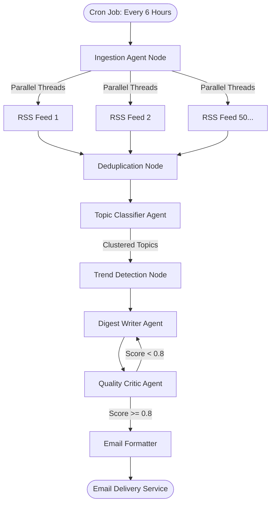

# 📘 Complete Learning Guide: From Zero to Agentic AI Systems Engineer

A progressive learning curriculum that teaches you everything about **AI Agents, Multi-Agent Systems, and the Agentic Research Assistant** — from absolute beginner concepts to senior AI engineer-level system design.

> **How to Use This Guide:**
> Start at Level 1 if you're new to AI agents. Skip ahead to your comfort level. Each level builds on the previous one.

---

## 📋 Table of Contents

| Level | Title                                                                                            | Who It's For                              |
| :---: | :----------------------------------------------------------------------------------------------- | :---------------------------------------- |
| 🟢 1 | [What is an AI Agent?](#-level-1-what-is-an-ai-agent)                                             | Absolute beginners, curious learners      |
| 🟡 2 | [How Multi-Agent Systems Work](#-level-2-how-multi-agent-systems-work)                            | Students who understand basic Python      |
| 🟠 3 | [Line-by-Line Code Walkthrough](#-level-3-line-by-line-code-walkthrough)                          | Developers learning AI engineering        |
| 🔴 4 | [Design Patterns &amp; Architecture Decisions](#-level-4-design-patterns--architecture-decisions) | Intermediate AI/ML engineers              |
| ⚫ 5 | [Interview Questions &amp; System Design](#-level-5-interview-questions--system-design)           | Senior engineers preparing for interviews |

---

# 🟢 Level 1: What is an AI Agent?

## 1.1 The Simplest Explanation

**A chatbot** waits for you to ask a question, gives ONE answer, and stops.

**An AI agent** receives a GOAL, makes its own plan, uses tools, checks its own work, and keeps going until the goal is achieved.

```
CHATBOT:
   You: "What is quantum computing?"
   Bot: "Quantum computing is..." (done)

AI AGENT:
   You: "Research quantum computing's impact on cryptography"
   Agent: (thinking) "I need to..."
     → Step 1: Break this into sub-questions
     → Step 2: Search the web for each sub-question
     → Step 3: Search my local documents too
     → Step 4: Write a comprehensive report with citations
     → Step 5: Fact-check my own report against sources
     → Step 6: "Hmm, I missed some topics. Let me research more..."
     → Step 7: Revise the report
     → Step 8: "Quality looks good now! Here's your report."
```

## 1.2 Real-World Analogy: Hiring a Research Team

Imagine you're a CEO who needs a research report. You don't write it yourself — you hire a team:

| Team Member                   | Role                                                            | In Our System                           |
| :---------------------------- | :-------------------------------------------------------------- | :-------------------------------------- |
| **Research Manager**    | Breaks the topic into specific questions                        | `planner.py`                          |
| **Research Assistants** | Search the internet and company files                           | `web_search.py` + `vector_store.py` |
| **Lead Writer**         | Synthesizes findings into a polished report                     | `writer.py`                           |
| **Peer Reviewer**       | Fact-checks the report against sources                          | `critic.py`                           |
| **The Whiteboard**      | Where everyone writes their progress                            | `state.py` (ResearchState)            |
| **The Manager**         | Decides workflow: "reviewer says redo → send back to research" | `graph.py`                            |

The key insight: **These team members don't talk to each other directly.** They all read and write to a shared whiteboard (`ResearchState`). The manager (`graph.py`) controls who works next.

## 1.3 Why Can't a Single LLM Prompt Do This?

A single prompt to ChatGPT/Claude suffers from three fundamental problems:

| Problem                      | What Happens                                          | How Agents Fix It                                            |
| :--------------------------- | :---------------------------------------------------- | :----------------------------------------------------------- |
| **Knowledge Cutoff**   | The model doesn't know events after its training date | Agents**search the live web** for current information  |
| **Hallucination**      | The model confidently states false information        | Agents**fact-check** their output against real sources |
| **No Self-Correction** | If the answer is wrong, the model doesn't know        | Agents**score their own work** and revise if needed    |

## 1.4 Key Vocabulary

Before moving on, make sure you understand these terms:

- **LLM** (Large Language Model): The AI brain that processes text (e.g., Llama, Gemini, GPT)
- **Node**: A single processing step in the agent pipeline (like a team member)
- **State**: The shared data dictionary that all nodes can read and write
- **Edge**: A connection between nodes that defines execution order
- **Graph**: The complete workflow of nodes and edges
- **RAG** (Retrieval-Augmented Generation): Giving the LLM real data to read before answering
- **Reflection Loop**: The agent checking its own work and revising if needed

---

# 🟡 Level 2: How Multi-Agent Systems Work

## 2.1 Linear Pipelines vs. Cyclic Graphs

Most beginner AI tutorials show **linear pipelines** (also called DAGs — Directed Acyclic Graphs):

```
[Input] → [Process A] → [Process B] → [Process C] → [Output]
```

Linear pipelines always move FORWARD. If Step C produces bad output, too bad — it's already done.

Our system uses a **Cyclic Graph** — it can LOOP BACK:

```
[Planner] → [Research] → [Writer] → [Critic] → Score >= 0.8? → [Finalizer]
                ↑                                    |
                └──── Score < 0.8 ───────────────────┘
                         (revision loop)
```

The loop between Critic → Research → Writer → Critic is what makes this system "agentic" — it can self-correct.

## 2.2 The Shared State Bus Pattern

In our system, agents don't send messages to each other like humans in a chat. Instead, they all read from and write to a **shared dictionary** called `ResearchState`:

```python
# This is the "whiteboard" — defined in src/state.py
class ResearchState(TypedDict):
    topic: str                    # What the user asked about
    sub_questions: List[str]      # Planner breaks topic into questions
    search_queries: List[str]     # Clean search strings for web search
    web_results: List[Dict]       # What we found on the internet
    retrieved_docs: List[Dict]    # What we found in uploaded PDFs
    draft_report: str             # The Writer's report draft
    critic_score: float           # Quality score (0.0 to 1.0)
    critic_feedback: str          # What the Critic says needs fixing
    revision_count: int           # How many times we've revised
    final_report: str             # The finished report
    status_log: List[str]         # Progress messages for the UI
```

**How mutations work**: Each agent reads the state, does work, and returns ONLY the keys it wants to update. LangGraph merges those updates into the shared state automatically.

```python
# The Planner reads "topic" and writes "sub_questions" + "search_queries"
def planner_agent_node(state: dict) -> dict:
    topic = state["topic"]           # READ from state
    # ... do work ...
    return {
        "sub_questions": [...],      # WRITE to state
        "search_queries": [...]      # WRITE to state
        # "topic" is NOT returned, so it stays unchanged
    }
```

## 2.3 The Reflection Loop (Self-Correction)

This is the most important concept in the entire system:

```
┌─────────────────────────────────────────────────────────────────┐
│                    THE REFLECTION LOOP                          │
│                                                                 │
│   [Writer] creates draft report                                 │
│       ↓                                                         │
│   [Critic] evaluates: "Is this report grounded in evidence?"    │
│       ↓                                                         │
│   Score >= 0.8?  ──YES──→  [Finalizer] → Done!                  │
│       │                                                         │
│       NO (and revisions < 2)                                    │
│       ↓                                                         │
│   Critic writes feedback: "Missing analysis of X"               │
│   Critic writes new search queries: ["X research 2026"]         │
│       ↓                                                         │
│   [Research] searches with NEW queries                          │
│       ↓                                                         │
│   [Writer] reads feedback + new evidence → improved draft       │
│       ↓                                                         │
│   [Critic] evaluates again...                                   │
└─────────────────────────────────────────────────────────────────┘
```

**Safety guarantee**: The loop can only run `MAX_REVISIONS` times (default: 2). After that, the report is finalized regardless of the score. This prevents infinite loops.

## 2.4 LangGraph Basics

[LangGraph](https://github.com/langchain-ai/langgraph) is the Python framework we use to build state graphs. Here's the minimal API:

```python
from langgraph.graph import StateGraph, END

# 1. Create a graph builder with your state schema
builder = StateGraph(ResearchState)

# 2. Add nodes (processing functions)
builder.add_node("planner", planner_function)
builder.add_node("writer", writer_function)

# 3. Wire edges (transitions)
builder.set_entry_point("planner")           # Start here
builder.add_edge("planner", "writer")        # Planner → Writer
builder.add_edge("writer", END)              # Writer → Stop

# 4. Compile and run
graph = builder.compile()
result = graph.invoke({"topic": "quantum computing"})
```

---

# 🟠 Level 3: Line-by-Line Code Walkthrough

## 3.1 `config.py` — The LLM Factory

**Purpose**: Creates LLM instances without agents knowing which provider is active.

```python
# The factory function — called by every agent node
def get_llm(model_name=None, temperature=0.2) -> BaseChatModel:
    provider = os.getenv("LLM_PROVIDER", "groq").lower()
  
    if provider == "groq":
        return ChatGroq(model="llama-3.3-70b-versatile", ...)
    elif provider == "google":
        return ChatGoogleGenerativeAI(model="gemini-1.5-flash", ...)
    elif provider == "ollama":
        return ChatOllama(model="llama3.2", ...)
```

**Why this matters**: If you want to switch from Groq to Gemini, you change ONE environment variable — not every agent file.

**Temperature guide**:

- `Planner (0.2)` — Mostly deterministic planning
- `Writer (0.3)` — Slightly creative for prose quality
- `Critic (0.1)` — Maximally consistent scoring

## 3.2 `src/state.py` — The Shared Whiteboard

**Purpose**: Defines the exact data structure shared by all agents.

**Critical concept — Partial Mutation**: When a node returns `{"sub_questions": [...]}`, LangGraph MERGES this into the existing state. All other keys (`topic`, `web_results`, etc.) remain unchanged.

## 3.3 `src/agents/planner.py` — Task Decomposition

**Purpose**: Breaks a broad topic into searchable sub-questions and clean queries.

**The JSON Prompting Pattern** (most important technique in this codebase):

```python
# 1. Prompt the LLM to return raw JSON
prompt = """Respond ONLY with a valid JSON object:
{"sub_questions": [...], "search_queries": [...]}"""

# 2. Invoke the LLM
response = llm.invoke(prompt)
content = response.content.strip()

# 3. Strip markdown formatting (LLMs often add ```json ... ```)
if content.startswith("```json"):
    content = content[7:]
if content.endswith("```"):
    content = content[:-3]

# 4. Parse JSON and validate with Pydantic
data = json.loads(content)
plan = PlannerOutput(**data)  # Pydantic checks types!
```

**Why not use LLM Tool Calling?** Tool-calling APIs have stricter rate limits (429 errors). JSON prompting achieves the same structured output without hitting those limits.

## 3.4 `src/tools/web_search.py` — Parallel Web Search

**Purpose**: Search DuckDuckGo for multiple queries simultaneously using threads.

**The ThreadPoolExecutor pattern**:

```python
from concurrent.futures import ThreadPoolExecutor, as_completed

# Run 3 searches simultaneously instead of one-by-one
with ThreadPoolExecutor(max_workers=3) as executor:
    # Submit all queries as background tasks
    futures = {executor.submit(search_one_query, q): q for q in queries}
  
    # Collect results as each thread finishes
    for future in as_completed(futures):
        results.extend(future.result())
```

**Performance**: Sequential = ~4.0s → Parallel = ~1.5s (3x speedup)

## 3.5 `src/agents/writer.py` — Citation Engine

**Purpose**: Synthesizes evidence into a Markdown report with numbered citations.

**The Citation Indexing Algorithm**:

```python
source_index = 1
for item in web_results:
    sources_text += f"[{source_index}] Title: {title}\nSnippet: {snippet}\n"
    references_table += f"| [{source_index}] | **{title}** | [{url}]({url}) |\n"
    source_index += 1

# The prompt tells the LLM: "Use [1], [2], [3] to cite sources"
```

**Revision awareness**: If `critic_feedback` contains revision instructions, they're injected into the prompt as "CRITICAL REVIEW FEEDBACK" so the Writer knows what to fix.

## 3.6 `src/agents/critic.py` — Quality Gate

**Purpose**: Fact-checks the draft against evidence and decides if revision is needed.

**Key decisions**:

- Draft is truncated to 3000 chars (the Critic evaluates quality, not completeness)
- Temperature = 0.1 (lowest in the system — scoring must be consistent)
- Fallback defaults to score = 0.88 (above threshold — fail-OPEN strategy)

## 3.7 `src/agents/graph.py` — The Conductor

**Purpose**: Wires all nodes and edges into an executable state graph.

**The conditional routing function**:

```python
def should_continue(state):
    score = state["critic_score"]
    revisions = state["revision_count"]
  
    # Two conditions for finalization (OR logic):
    if score >= 0.8 or revisions >= MAX_REVISIONS:
        return "finalize"      # Quality passed OR budget exhausted
    else:
        return "continue_revision"  # Need more work
```

**Graph assembly**:

```python
builder.add_conditional_edges(
    "critic",                    # After the Critic finishes...
    should_continue,             # Call this function to decide...
    {
        "continue_revision": "increment_revision",  # → Loop back
        "finalize": "finalizer"                      # → Exit
    }
)
```

---

# 🔴 Level 4: Design Patterns & Architecture Decisions

## 4.1 The 5-Layer Architecture

```
┌────────────────────────────────────────────────────────────────┐
│  LAYER 1: PRESENTATION (UI)                                    │
│  app.py — Streamlit Dashboard, Real-time Metrics, Exporter     │
│  Responsibility: User interaction, progress display            │
├────────────────────────────────────────────────────────────────┤
│  LAYER 2: GRAPH ORCHESTRATION                                  │
│  graph.py — StateGraph assembly, conditional routing           │
│  state.py — TypedDict schema defining the memory contract      │
│  Responsibility: Control flow, state management                │
├────────────────────────────────────────────────────────────────┤
│  LAYER 3: INTELLIGENCE AGENTS                                  │
│  planner.py — Task decomposition                               │
│  writer.py — Report synthesis + citation engine                │
│  critic.py — Quality evaluation + revision triggers            │
│  Responsibility: LLM-powered reasoning                         │
├────────────────────────────────────────────────────────────────┤
│  LAYER 4: RETRIEVAL & TOOL CONCURRENCY                         │
│  web_search.py — Multi-threaded DuckDuckGo search              │
│  vector_store.py — ChromaDB document retrieval                 │
│  Responsibility: External data access, I/O operations          │
├────────────────────────────────────────────────────────────────┤
│  LAYER 5: INFRASTRUCTURE & LLM FACTORY                         │
│  config.py — Multi-provider LLM factory (Groq/Gemini/Ollama)   │
│  Responsibility: Provider abstraction, configuration           │
└────────────────────────────────────────────────────────────────┘
```

**Dependency Rule**: Each layer only depends on layers BELOW it. Layer 3 agents call Layer 4 tools and Layer 5 config — never Layer 1 UI code.

## 4.2 Design Pattern Catalog

### Pattern 1: Factory Method (`config.py`)

```
Problem:  Agents need LLM instances but shouldn't know which provider is active
Solution: A single function get_llm() that creates the right instance based on config
Benefit:  Changing providers requires editing ONE environment variable
```

### Pattern 2: Data Transfer Object / Shared Bus (`state.py`)

```
Problem:  Agents need to communicate data between each other
Solution: A TypedDict schema that all agents read from and write to
Benefit:  Type safety at dev time, clear data contract, no direct coupling
```

### Pattern 3: Thread Pool (`web_search.py`)

```
Problem:  Sequential web searches are slow (4+ seconds for 3 queries)
Solution: Execute all searches simultaneously in separate threads
Benefit:  3x latency reduction (4.0s → 1.5s)
Why Threads (not Processes): Web I/O is I/O-bound, not CPU-bound
```

### Pattern 4: Direct JSON Prompting + Pydantic Validation (`planner.py`, `critic.py`)

```
Problem:  Need structured LLM output without hitting tool-calling rate limits
Solution: Prompt LLM to return raw JSON, parse with json.loads(), validate with Pydantic
Benefit:  Bypasses 429 RESOURCE_EXHAUSTED errors while maintaining type safety
```

### Pattern 5: State Machine with Guard Conditions (`graph.py`)

```
Problem:  Graph needs conditional branching and loops
Solution: Conditional edges with a routing function (should_continue)
Benefit:  Dynamic execution flow based on runtime state values
```

### Pattern 6: Graceful Degradation / Fail-Open (`planner.py`, `critic.py`)

```
Problem:  LLM calls can fail (timeout, malformed JSON, API errors)
Solution: try/except with sensible fallback defaults
Benefit:  System NEVER crashes — it degrades gracefully
```

## 4.3 JSON Prompting vs. Tool Calling: The Trade-off

| Dimension             | Tool Calling API                            | Direct JSON Prompting (Our Approach)                  |
| :-------------------- | :------------------------------------------ | :---------------------------------------------------- |
| **Rate Limits** | Strict (often 5-10 calls/min on free tiers) | Standard text generation limits (much higher)         |
| **Type Safety** | Built-in schema enforcement by provider     | Manual Pydantic validation after parsing              |
| **Reliability** | High (provider guarantees format)           | Medium (LLM may produce invalid JSON ~5% of the time) |
| **Portability** | Provider-specific API differences           | Works identically across ALL providers                |
| **Our Choice**  | ❌ Rejected (rate limit risk)               | ✅ Chosen (higher throughput + fallback handling)     |

## 4.4 Fail-Open vs. Fail-Closed Strategy

```
FAIL-OPEN (Our Critic):
  "If I can't evaluate quality, assume it's acceptable and deliver the report"
  → Good for: Research reports, content generation, low-stakes outputs
  → Risk: Potentially lower quality output

FAIL-CLOSED:
  "If I can't verify safety, BLOCK the output entirely"
  → Good for: Medical systems, financial transactions, safety-critical systems
  → Risk: System becomes unavailable during failures
```

## 4.5 Loop Termination Guarantee

Every cyclic graph MUST guarantee termination. Our system uses a dual-condition guard:

```python
if score >= 0.8 or revisions >= MAX_REVISIONS:
    return "finalize"
```

- **Quality path**: `score >= 0.8` → natural termination (report is good)
- **Budget path**: `revisions >= MAX_REVISIONS` → forced termination (prevent infinite loops)

This is analogous to the [Halting Problem](https://en.wikipedia.org/wiki/Halting_problem) — we can't prove the Critic will ever assign score >= 0.8, so we add an explicit budget constraint.

---

# ⚫ Level 5: Interview Questions & System Design

## 5.1 Conceptual Questions

**Q1: What is the difference between a chatbot and an AI agent?**

> A chatbot responds to a single prompt with a single answer. An AI agent receives a goal, decomposes it into tasks, uses tools, evaluates its own output, and iterates until the goal is met. Key differentiators: autonomy, tool use, planning, and self-correction.

**Q2: Why use a State Graph instead of a simple chain?**

> Chains are linear (A→B→C) and can't loop back. State Graphs support conditional edges and cycles, enabling the system to revise its work based on quality evaluation. This is essential for self-correcting behavior.

**Q3: What is "groundedness" in the context of RAG systems?**

> Groundedness measures whether the generated text is supported by retrieved evidence. A groundedness score of 0.85 means ~85% of the report's claims can be traced back to source documents or web results. Ungrounded claims are potential hallucinations.

**Q4: Why use TypedDict for state instead of a regular Python dict?**

> TypedDict provides static type checking at development time (IDE autocomplete, typo detection via Pyright/MyPy). It documents the data contract and helps LangGraph understand the state schema. A regular dict would work at runtime but offers zero safety nets.

## 5.2 Architecture & Design Questions

**Q5: Explain the trade-off between JSON prompting and tool calling.**

> Tool calling provides provider-guaranteed structured output but has strict rate limits on free tiers (429 RESOURCE_EXHAUSTED). JSON prompting has higher throughput and works identically across all providers but requires manual parsing and ~5% failure handling with Pydantic validation + fallback defaults.

**Q6: Why is the web search implemented with ThreadPoolExecutor instead of asyncio?**

> Both would work for I/O-bound network requests. ThreadPoolExecutor was chosen for simplicity — LangGraph nodes are synchronous functions, so using threads avoids the complexity of async/await propagation through the entire call stack. For a production system with hundreds of concurrent users, asyncio would be more scalable.

**Q7: How do you prevent the reflection loop from running infinitely?**

> Dual-condition guard: `if score >= 0.8 or revisions >= MAX_REVISIONS: return "finalize"`. The quality check provides natural termination, and the revision budget provides forced termination. This guarantees the graph always halts, regardless of the Critic's behavior.

**Q8: What happens if the Critic agent's LLM call fails?**

> Fail-open strategy: defaults to score=0.88 (above threshold) and generic positive feedback. This ensures the pipeline delivers a report even when the quality check fails. The rationale is that a report that passed Planner+Research+Writer stages is likely adequate, and blocking delivery on a Critic failure would degrade user experience.

## 5.3 Production Engineering Questions

**Q9: How would you scale this system for 1000 concurrent users?**

> Current bottleneck: LLM API rate limits (30 RPM on Groq free tier). Solutions:
>
> 1. Deploy dedicated LLM instances (Groq paid tier, or self-hosted via Ollama cluster)
> 2. Implement request queueing with Redis/Celery for async processing
> 3. Add response caching for repeated topics (hash topic → cached report)
> 4. Use asyncio instead of ThreadPoolExecutor for web search
> 5. Deploy Streamlit behind a load balancer with session affinity

**Q10: How would you add observability to this system?**

> 1. **LangSmith Integration**: Already configured in .env (LANGCHAIN_TRACING_V2=true). Traces every LLM call, state transition, and edge routing decision.
> 2. **Structured Logging**: Every node already logs to Python's logging module. Route to ELK stack or CloudWatch.
> 3. **Metrics Dashboard**: Track latency per node, critic_score distribution, revision_count histogram, web_search success rate.
> 4. **Alerting**: Alert on critic_score < 0.5 (consistently poor quality) or web_search returning 0 results.

**Q11: What are the security concerns with this system?**

> 1. **API Key Exposure**: Keys stored in .env files, excluded from Git via .gitignore. In production, use a secrets manager (AWS Secrets Manager, GCP Secret Manager).
> 2. **Prompt Injection**: User topic input is passed directly to LLM prompts. A malicious user could inject instructions. Mitigation: input sanitization and prompt isolation.
> 3. **Web Search Content**: DuckDuckGo results may contain malicious or misleading content. The Critic partially mitigates this by evaluating groundedness.
> 4. **Data Leakage**: Uploaded PDFs are stored locally. In multi-tenant production, implement collection isolation per user.

**Q12: How would you add a new agent node (e.g., a "Summarizer" that creates a 1-page executive brief)?**

> 1. Create `src/agents/summarizer.py` with a `summarizer_agent_node(state) -> dict` function
> 2. Add a `summary` field to `ResearchState` in `state.py`
> 3. Register the node: `builder.add_node("summarizer", summarizer_agent_node)`
> 4. Wire it: `builder.add_edge("finalizer", "summarizer")` and `builder.add_edge("summarizer", END)`
> 5. Update `app.py` to display the summary in a new tab

## 5.4 System Design Exercise

**Design Prompt**: "Design a multi-agent system that monitors 50 news sources, identifies trending AI topics, and generates daily digest emails."

**Model Answer Using Patterns From This System**:



**Key design decisions from our system applied here**:

1. **ThreadPoolExecutor** for parallel RSS ingestion (same pattern as `web_search.py`)
2. **Shared State Bus** for passing articles between nodes (same as `ResearchState`)
3. **Critic + Reflection Loop** for quality assurance (same as our `critic.py` + `should_continue`)
4. **MAX_REVISIONS guard** to prevent infinite loops on stubborn Critic scores
5. **Factory Method** for LLM provider switching (same as `config.py`)
