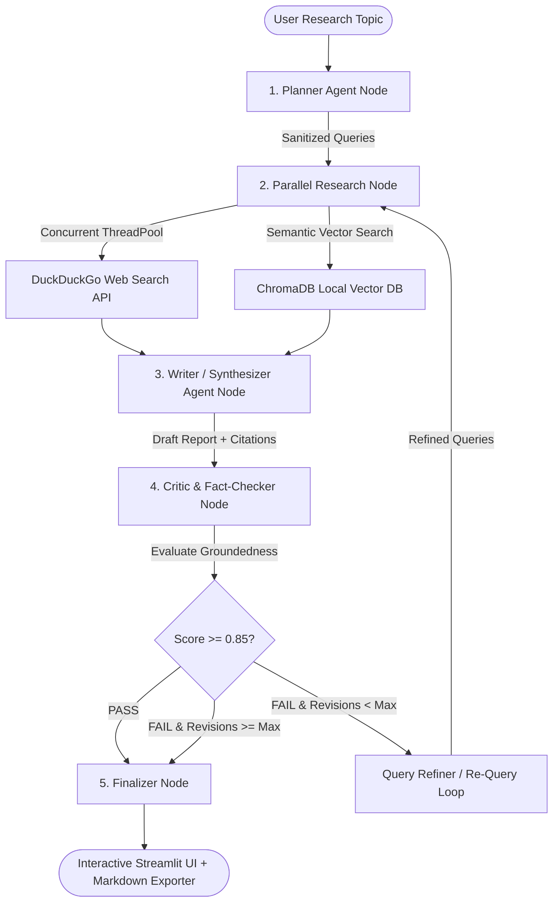

# 🤖 Agentic Research Assistant — Multi-Agent Collaboration Engine

A production-grade, stateful multi-agent research system built with **LangGraph**, **Groq Llama-3.3-70B**, **Google Gemini**, **ChromaDB**, and **Multi-Threaded DuckDuckGo Retrieval**.

The system replaces traditional monolithic LLM prompts with a network of specialized autonomous agents operating over a shared state graph with automated reflection and quality gates.

> 🧠 **Architectural Specification:**
> Read **[SYSTEM_ENGINEERING_GUIDE.md](SYSTEM_ENGINEERING_GUIDE.md)** for component breakdowns, state bus mutability, and design patterns.
>
> 📘 **Technical Deep-Dive:**
> Read **[AGENTIC_TUTORIAL.md](AGENTIC_TUTORIAL.md)** for state machine logic, Pydantic schemas, and execution traces.

---

## 🏗️ System Architecture & Graph Control Flow



---

## 🧩 Component Breakdown

### 1. Planner Agent (`src/agents/planner.py`)
* **Role:** Task Decomposition & Query Optimization.
* **Mechanism:** Takes the input topic and generates 4 sub-questions and sanitized 3-5 word search query strings using direct JSON prompting validated against `PlannerOutput` Pydantic schemas.

### 2. Research Node (`src/agents/graph.py` & `src/tools/`)
* **Role:** Multi-Source Hybrid Retrieval.
* **Mechanism:** Concurrently executes DuckDuckGo web searches (`src/tools/web_search.py`) in parallel threads via Python `ThreadPoolExecutor` (reducing retrieval latency by 3x). Concurrently queries local `ChromaDB` vector storage (`src/tools/vector_store.py`) for uploaded PDF passages.

### 3. Writer Agent (`src/agents/writer.py`)
* **Role:** Context Synthesis & Citation Formatting.
* **Mechanism:** Synthesizes retrieved evidence into a publication-grade Markdown report featuring executive summaries, bulleted key takeaways, comparison tables, inline numerical citations (`[1]`, `[2]`), and clickable references tables.

### 4. Critic & Fact-Checker Node (`src/agents/critic.py`)
* **Role:** Quality Evaluation & Reflection Gate.
* **Mechanism:** Evaluates draft groundedness against source context. Assigns a quality score (`0.0 - 1.0`) validated via `CriticEvaluation`. If `score < 0.85` and `revision_count < MAX_REVISIONS`, triggers query refinement and loops back to retrieval.

### 5. Multi-Provider Engine Factory (`config.py`)
* **Role:** Provider-Agnostic LLM Abstraction.
* **Mechanism:** Factory function (`get_llm`) supporting **Groq** (`llama-3.3-70b-versatile`), **Google Gemini** (`gemini-1.5-flash`), and local **Ollama** models (`llama3.2`).

---

## 🧰 Technical Stack & Dependencies

* **State Graph Orchestration:** `LangGraph` (`StateGraph`, `END`)
* **Language Model Engine:** Multi-Provider Abstraction (`langchain-groq`, `langchain-google-genai`, `langchain-community`)
* **Concurrency:** Python `concurrent.futures.ThreadPoolExecutor`
* **Vector Store:** `ChromaDB` (Persistent Client)
* **Web Search:** `ddgs` (DuckDuckGo Search with HTTP scraper fallback)
* **Data Contracts:** `Pydantic v2`
* **Presentation Layer:** `Streamlit` (Real-time latency timer & Markdown file exporter)
* **Observability:** `LangSmith`

---

## 🚀 Environment Setup & Local Execution

### 1. Install Dependencies
```bash
cd Agentic_Research_Assistant
pip install -r requirements.txt
```

### 2. Configure Environment Variables
Copy `.env.example` to `.env` and set your preferred provider key:
```bash
cp .env.example .env
```
* **Groq API Key (Recommended):** Set `GROQ_API_KEY=gsk_your_key` (Free key at [console.groq.com](https://console.groq.com/)).
* **Google Gemini API Key:** Set `GOOGLE_API_KEY=your_key` (Free key at [aistudio.google.com](https://aistudio.google.com/)).

### 3. Launch Streamlit Application
```bash
streamlit run app.py
```
