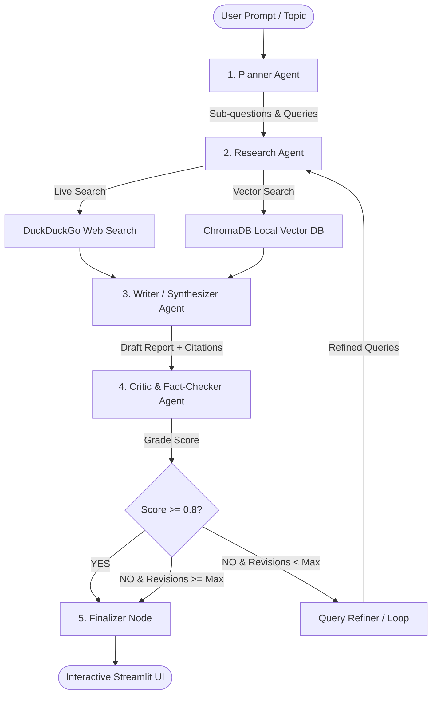

# 🤖 Agentic Research Assistant — Multi-Agent Collaboration Engine

A production-grade, multi-agent research engine built with **LangGraph**, **Google Gemini 2.0 Flash**, **ChromaDB**, and **DuckDuckGo Web Search**.

Unlike traditional single-prompt LLM wrappers, this system deploys an autonomous network of specialized agents operating over a shared state graph with dynamic self-correction and fact-checking reflection loops.

> 🧠 **Thinking like a Senior AI Engineer?**
> Read the complete architectural breakdown: **[SYSTEM_ENGINEERING_GUIDE.md](SYSTEM_ENGINEERING_GUIDE.md)** (covering state buses, line-by-line codebase anatomy, and mental models).
>
> 📘 **Looking for the deep-dive technical tutorial & interview questions?**
> Read the complete reference guide: **[AGENTIC_TUTORIAL.md](AGENTIC_TUTORIAL.md)**.

---

## 🏗️ System Architecture



---

## 🧩 Agent Roles & Responsibilities

1. **Planner Agent:** Uses Pydantic structured output to decompose complex user topics into 4 targeted sub-questions and search engine queries.
2. **Research Agent:** Executes hybrid search across live web APIs (`duckduckgo-search`) and local vector stores (`ChromaDB`).
3. **Writer / Synthesizer Agent:** Assembles context snippets into a structured research draft with inline numerical citations (`[1]`, `[2]`).
4. **Critic & Fact-Checker Agent:** Evaluates draft groundedness, checks for hallucinations, assigns a quality score (0.0 to 1.0), and triggers revision loops if necessary.

---

## 🧰 Tech Stack

* **Graph Orchestration:** `LangGraph`
* **LLM Engine:** Multi-Provider support for **Groq** (`llama-3.3-70b`), **Google Gemini** (`gemini-1.5-flash`), and **Ollama** (Local `llama3.2`)
* **Vector Store:** `ChromaDB` (Local persistence)
* **Web Search:** `duckduckgo-search`
* **Data Schemas:** `Pydantic v2`
* **UI Framework:** `Streamlit`
* **Observability:** `LangSmith`

---

## 🚀 Quickstart Guide

### 1. Install Dependencies

```bash
cd Agentic_Research_Assistant
pip install -r requirements.txt
```

### 2. Configure Environment Variables

Copy `.env.example` to `.env` and insert your free Google Gemini API key:

```bash
cp .env.example .env
```

Get a free key at [Google AI Studio](https://aistudio.google.com/).

### 3. Launch Streamlit Web App

```bash
streamlit run app.py
```

---

## 📊 Resume Speaking Points

> **Agentic Research Assistant | LangGraph, Gemini 2.0, ChromaDB, Pydantic, Streamlit**
>
> - Built an autonomous multi-agent research engine using **LangGraph** to decompose complex topics into sub-questions and execute hybrid search across vector databases and live web search.
> - Implemented an automated **Self-Correction & Reflection Loop** using a Critic agent to grade hallucination risk, achieving reliable context-grounded outputs with automated query refinement.
> - Designed structured output schemas using **Pydantic** and optimized token usage via Google Gemini 2.0 Flash API.
> - Integrated **LangSmith** for full agent execution tracing, state visualization, and latency benchmarking.
