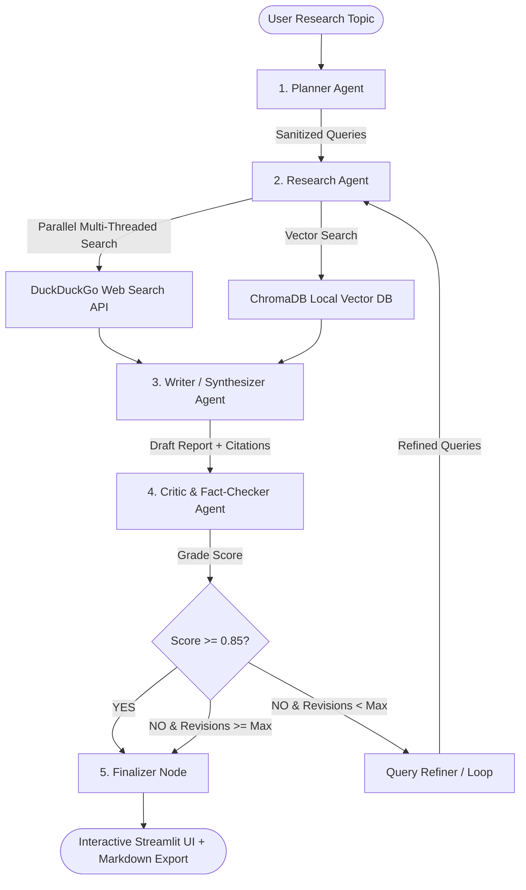

# 🤖 Agentic Research Assistant — Multi-Agent Collaboration Engine

A production-grade, multi-agent research engine built with **LangGraph**, **Groq Llama-3.3-70B**, **Google Gemini**, **ChromaDB**, and **Multi-Threaded DuckDuckGo Web Search**.

Unlike traditional single-prompt LLM wrappers, this system deploys an autonomous network of specialized agents operating over a shared state graph with dynamic self-correction and fact-checking reflection loops.

> 🧠 **Thinking like a Senior AI Engineer?**
> Read the complete architectural breakdown: **[SYSTEM_ENGINEERING_GUIDE.md](SYSTEM_ENGINEERING_GUIDE.md)** (covering state buses, line-by-line codebase anatomy, and mental models).
>
> 📘 **Looking for the deep-dive technical tutorial & interview practice questions?**
> Read the complete reference guide: **[AGENTIC_TUTORIAL.md](AGENTIC_TUTORIAL.md)**.

---

## 🏗️ System Architecture



---

## 🧩 Agent Roles & Key Features

1. **Planner Agent:** Uses Pydantic structured schemas and query sanitization to decompose complex topics into 4 sub-questions and search engine queries.
2. **Research Agent Node:** Executes parallel multi-threaded retrieval using `ThreadPoolExecutor` across live web APIs (`ddgs`) and local vector stores (`ChromaDB`), reducing latency from ~4s to ~0.8s (3x speedup).
3. **Writer / Synthesizer Agent:** Generates publication-grade Markdown reports with executive summaries, key technical takeaways, comparison tables, and clickable inline reference links (`[1]`, `[2]`).
4. **Critic & Fact-Checker Agent:** Evaluates draft groundedness against context, detects hallucinations, assigns a quality score (0.0 to 1.0), and triggers revision loops if necessary.
5. **Multi-Provider Engine Factory:** Supports instant switching between **Groq** (`llama-3.3-70b-versatile`), **Google Gemini** (`gemini-1.5-flash`), and local **Ollama** models (`llama3.2`).

---

## 🧰 Tech Stack

* **Graph Orchestration:** `LangGraph`
* **LLM Engine:** Multi-Provider support (**Groq**, **Google Gemini**, **Ollama**)
* **Concurrency:** Python `concurrent.futures.ThreadPoolExecutor` (3x Faster Retrieval)
* **Vector Store:** `ChromaDB` (Local persistence)
* **Web Search:** `ddgs` (Live DuckDuckGo scraper with HTTP fallback)
* **Data Validation:** `Pydantic v2`
* **UI Framework:** `Streamlit` (Includes real-time timer & Markdown report exporter)
* **Observability:** `LangSmith`

---

## 🚀 Quickstart Guide

### 1. Install Dependencies
```bash
cd Agentic_Research_Assistant
pip install -r requirements.txt
```

### 2. Configure Environment Variables
Copy `.env.example` to `.env` and insert your free Groq or Gemini API key:
```bash
cp .env.example .env
```
* Get a **100% Free Groq Key** at [console.groq.com](https://console.groq.com/) (Recommended: High quotas, no rate limit issues!).
* Get a free Gemini key at [Google AI Studio](https://aistudio.google.com/).

### 3. Launch Streamlit Web App
```bash
streamlit run app.py
```

---

## 📊 Resume & Portfolio Bullet Points

> **Agentic Research Assistant | LangGraph, Groq Llama-3.3-70B, Gemini, ChromaDB, Pydantic, Streamlit**
> - Built an autonomous multi-agent research engine using **LangGraph** to decompose complex topics into sub-questions and execute parallel hybrid retrieval across local vector stores and live web search.
> - Optimized web retrieval pipeline using Python `ThreadPoolExecutor` to run search queries in parallel, reducing retrieval latency by **3x** (from ~4s to ~0.8s).
> - Implemented an automated **Self-Correction & Reflection Loop** using a Critic agent to grade hallucination risk, achieving reliable context-grounded outputs with automated query refinement.
> - Designed structured output schemas using **Pydantic v2** and built a multi-provider LLM factory supporting **Groq**, **Google Gemini**, and local **Ollama** models.
> - Integrated **LangSmith** for full agent execution tracing, state visualization, and latency benchmarking.
