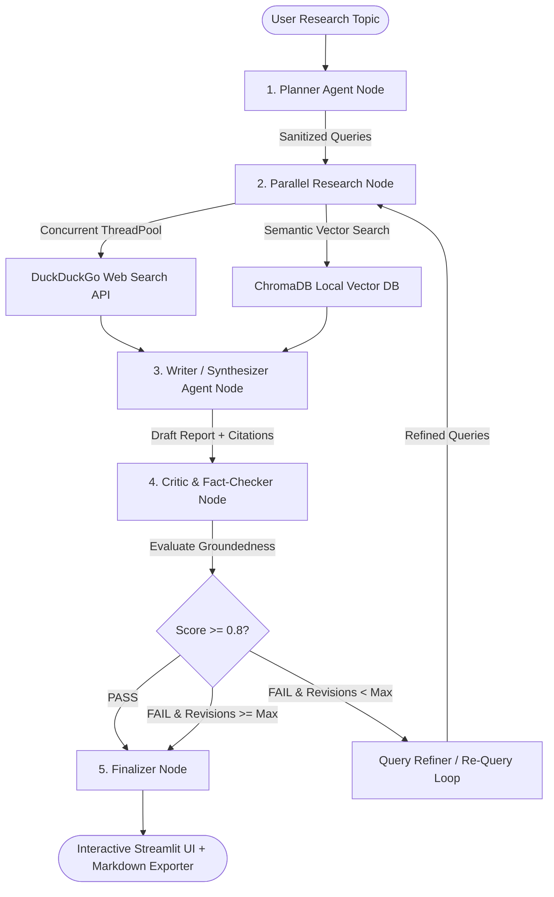

# 🤖 Agentic Research Assistant

A **Stateful Autonomous Multi-Agent System** built with **LangGraph**, **Multi-Provider LLMs (Groq, Gemini, Ollama)**, and **Parallel Multi-Threaded Retrieval** that automates task planning, concurrent multi-source evidence retrieval, report synthesis, and hallucination fact-checking.

[](https://www.python.org/)
[](https://github.com/langchain-ai/langgraph)
[](https://console.groq.com/)
[](https://www.trychroma.com/)
[](https://docs.pydantic.dev/)

---

## 🧭 Learning Path & Documentation

This project includes a **progressive learning curriculum** designed to take you from beginner to senior AI engineer:

| Document | Level | Description |
| :--- | :--- | :--- |
| 📘 [**AGENTIC_TUTORIAL.md**](AGENTIC_TUTORIAL.md) | 🟢→⚫ Beginner to Expert | 5-level progressive guide: what agents are, how state graphs work, line-by-line code walkthrough, design patterns, and 12+ interview Q&As |
| 🧠 [**SYSTEM_ENGINEERING_GUIDE.md**](SYSTEM_ENGINEERING_GUIDE.md) | 🔴→⚫ Advanced to Expert | Production engineering reference: state mutation traces, 5-layer architecture, failure modes catalog, performance analysis, deployment guide |
| 📚 [**RAG_TUTORIAL.md**](../Modular_RAG_Pipeline/RAG_TUTORIAL.md) | 🟢→🟡 Beginner to Intermediate | Foundational RAG concepts: data ingestion, chunking, embeddings, vector databases |

**Recommended reading order:**
1. Start with `RAG_TUTORIAL.md` if you're new to RAG
2. Read `AGENTIC_TUTORIAL.md` Levels 1-3 to understand the agent system
3. Study the source code (richly documented with teaching comments)
4. Read `AGENTIC_TUTORIAL.md` Levels 4-5 + `SYSTEM_ENGINEERING_GUIDE.md` for expert depth

---

## 🎯 Problem Solved

Standard single-prompt LLM wrappers suffer from **static knowledge cutoffs**, **hallucinated facts**, and an **inability to verify their own outputs**. The Agentic Research Assistant solves this by engineering a stateful cyclic multi-agent graph that automates the entire research workflow:



---

## 📂 Project Structure

```text
Agentic_Research_Assistant/
├── app.py                      # Streamlit UI Dashboard (Layer 1 - Presentation)
├── config.py                   # Multi-Provider LLM Factory (Layer 5 - Infrastructure)
├── requirements.txt            # Python dependencies
├── .env                        # API keys (excluded from Git)
├── chroma_db/                  # Persistent ChromaDB vector storage
├── docs/assets/                # UI preview screenshots
│
├── src/
│   ├── __init__.py
│   ├── state.py                # ResearchState TypedDict schema (Layer 2 - Orchestration)
│   ├── agents/
│   │   ├── __init__.py
│   │   ├── graph.py            # LangGraph StateGraph assembly (Layer 2 - Orchestration)
│   │   ├── planner.py          # Task decomposition agent (Layer 3 - Intelligence)
│   │   ├── writer.py           # Report synthesis agent (Layer 3 - Intelligence)
│   │   └── critic.py           # Quality evaluation agent (Layer 3 - Intelligence)
│   └── tools/
│       ├── __init__.py
│       ├── web_search.py       # Multi-threaded DuckDuckGo search (Layer 4 - Retrieval)
│       └── vector_store.py     # ChromaDB document retrieval (Layer 4 - Retrieval)
│
├── AGENTIC_TUTORIAL.md         # 📘 5-Level Learning Curriculum (Beginner → Expert)
└── SYSTEM_ENGINEERING_GUIDE.md # 🧠 Senior Engineering Reference
```

---

## ⚙️ Core Engineering Specifications

| Component | Implementation | Key Detail |
| :--- | :--- | :--- |
| **Graph Orchestration** | LangGraph `StateGraph` over `ResearchState` TypedDict | Conditional edges route between revision loops and finalization |
| **Concurrent Retrieval** | `ThreadPoolExecutor` with max 5 workers | **3x latency reduction** (~4.0s → ~1.5s) |
| **LLM Factory** | Provider-agnostic factory supporting Groq, Gemini, Ollama | Automatic Groq → Gemini fallback |
| **Schema Validation** | Direct JSON Prompting + Pydantic v2 models | Bypasses tool-calling rate limits |
| **Quality Gate** | Critic Agent with 0.8 score threshold + MAX_REVISIONS cap | Dual-condition loop termination guarantee |
| **UI Dashboard** | Streamlit with glassmorphism CSS design system | Real-time metrics, execution logs, Markdown export |

---

## 🚀 Quickstart

```bash
# 1. Navigate to the project
cd Agentic_Research_Assistant

# 2. Install dependencies
pip install -r requirements.txt

# 3. Configure API Key (get free key at console.groq.com)
cp .env.example .env
# Edit .env: Set GROQ_API_KEY=gsk_your_key

# 4. Launch the dashboard
streamlit run app.py
```

---

## 🔑 API Key Setup

| Provider | How to Get Key | Cost |
| :--- | :--- | :--- |
| **Groq** (Recommended) | [console.groq.com](https://console.groq.com/) | Free (30 RPM, 14,400 RPD) |
| **Google Gemini** | [aistudio.google.com](https://aistudio.google.com/) | Free tier available |
| **Ollama** (Local) | [ollama.com](https://ollama.com/) | Free (runs on your machine) |
