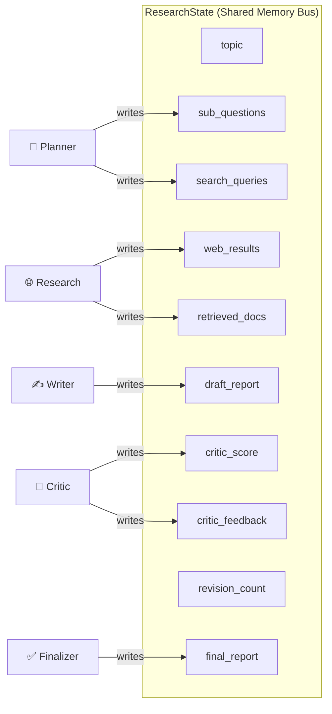

# 🧠 Senior AI Systems Engineering Reference: Agentic Research Assistant

A production-grade system design document detailing the architecture, state machine mechanics, data flow, optimization patterns, failure mode analysis, and deployment considerations of the **Agentic Research Assistant**.

---

## 📐 1. System Engineering Principles

### 1.1 The Deterministic Wrapper Principle

> **Engineering Rule:** LLMs are non-deterministic reasoning components. Production AI software must encapsulate non-deterministic LLM calls inside **deterministic software contracts** — using explicit State Graphs, TypedDict schemas, Pydantic data validation, and strict condition gates.

The Agentic Research Assistant implements this principle at every layer:
- **State Contract**: `ResearchState` TypedDict enforces the data schema at development time
- **Schema Validation**: Pydantic models (`PlannerOutput`, `CriticEvaluation`) validate LLM outputs at runtime
- **Conditional Guards**: `should_continue()` routing function uses deterministic boolean logic, not LLM judgment
- **Budget Constraints**: `MAX_REVISIONS` cap guarantees termination regardless of LLM behavior

### 1.2 System Evolution: From Monolithic to Multi-Agent

```text
STAGE 1 — Monolithic LLM Pipeline (Traditional):
  Input ──→ [Single LLM Prompt + Static Vector Context] ──→ Unverified Text Output
  ❌ No verification, no self-correction, knowledge cutoff

STAGE 2 — Linear RAG Chain (Modular RAG Pipeline):
  Input ──→ [Loader] → [Chunker] → [Embedder] → [VectorDB] → [Retriever] → [LLM] → Output
  ✅ External knowledge, ❌ No verification, ❌ No self-correction

STAGE 3 — Stateful Multi-Agent Graph (This System):
  Input ──→ [State Machine Bus: ResearchState]
                 │
                 ├──→ [Planner Node] ────────→ Sanitized Tasks & Search Terms
                 ├──→ [Concurrent Tools] ──→ Parallel Web + Vector Retrieval
                 ├──→ [Writer Node] ─────────→ Cited Markdown Report
                 └──→ [Critic Node] ─────────→ Groundedness Reflection Gate
                                                    │
                                                    ├──→ PASS (Score ≥ 0.8): Finalizer
                                                    └──→ FAIL (Score < 0.8): Dynamic Re-Query Loop
  ✅ External knowledge, ✅ Automated verification, ✅ Self-correction loops
```

---

## 💬 2. State Machine Architecture & Data Mutability

### 2.1 The Shared Memory Bus Pattern

Agent nodes in this system do **not** communicate via conversational natural language messages. Instead, they interact via a **Shared State Bus** (`ResearchState`) in system memory. Each node is a pure function that consumes `ResearchState`, executes processing, and returns a dictionary of state key mutations.



### 2.2 State Mutation Lifecycle Trace

The following trace shows the exact state dictionary at each stage for a real execution:

#### Initial State (`app.py` Submission)
```python
{
    "topic": "Impact of Quantum Computing on Cryptography",
    "sub_questions": [],
    "search_queries": [],
    "retrieved_docs": [],
    "web_results": [],
    "draft_report": "",
    "critic_score": 0.0,
    "critic_feedback": "",
    "revision_count": 0,
    "final_report": "",
    "status_log": []
}
```

#### Mutation 1: `planner_agent_node`
```python
# Planner reads "topic", writes "sub_questions" + "search_queries"
{
    "sub_questions": [
        "What is Shor's algorithm impact on RSA encryption?",
        "What are lattice-based post-quantum cryptography standards?",
        "What is NIST implementation timeline for PQC?",
        "What are symmetric encryption key length requirements?"
    ],
    "search_queries": [
        "Shors algorithm RSA quantum impact",
        "NIST post quantum cryptography standards 2026",
        "quantum computing AES 256 key size"
    ]
}
```

#### Mutation 2: `research_agent_node` (Parallel Multi-Threaded Execution)
```python
# Research reads "search_queries", writes "web_results" + "retrieved_docs"
# web_search.py runs all 3 queries in parallel via ThreadPoolExecutor
{
    "web_results": [
        {"title": "NIST Finalizes Post-Quantum Standards", "url": "https://...", "snippet": "NIST released primary post-quantum algorithms..."},
        {"title": "Shor Algorithm Quantum Complexity", "url": "https://...", "snippet": "Shor algorithm breaks asymmetric encryption..."}
    ],
    "retrieved_docs": [
        {"content": "Lattice cryptography security bounds...", "source": "quantum_paper.pdf"}
    ]
}
```

#### Mutation 3: `writer_agent_node`
```python
# Writer reads topic, sub_questions, web_results, retrieved_docs, critic_feedback
# Writes "draft_report" — a complete Markdown document with inline citations
{
    "draft_report": "# Impact of Quantum Computing on Cryptography\n\n## 📌 Executive Summary\nQuantum computing poses a fundamental challenge to asymmetric cryptography [1]..."
}
```

#### Mutation 4: `critic_agent_node`
```python
# Critic reads draft_report, web_results, retrieved_docs
# Writes score, feedback, and optionally revised search queries
{
    "critic_score": 0.78,  # Below 0.8 threshold → triggers revision
    "critic_feedback": "Draft requires detailed analysis of Grover algorithm impact on AES.",
    "search_queries": ["Grover algorithm AES 256 symmetric key security"]
}
```

#### Routing Gate (`should_continue`)
- Evaluates: `score = 0.78` and `revisions = 0 < MAX_REVISIONS (2)`
- Returns `"continue_revision"` → routes to `increment_revision_node`
- `revision_count` incremented to `1`
- Loops back to `research_agent_node` with **new** search queries from the Critic

#### Mutation 5+: Second Revision Cycle
The Research, Writer, and Critic nodes execute again with the refined queries. If the new score ≥ 0.8, the graph routes to `finalizer_node` and terminates.

---

## 🏛️ 3. 5-Layer Component Architecture

```text
┌─────────────────────────────────────────────────────────────────────────┐
│                      LAYER 1: PRESENTATION (UI)                         │
│   app.py — Streamlit Dashboard                                          │
│   - Glassmorphism CSS design system with Inter/Outfit/JetBrains Mono    │
│   - 4-column metric cards (Groundedness, Latency, Loops, Sources)       │
│   - Real-time st.status() execution log                                 │
│   - Tabbed output (Report / Evidence / Engine Metrics)                  │
│   - PDF/TXT file upload → ChromaDB ingestion                           │
│   - Markdown report download exporter                                   │
├─────────────────────────────────────────────────────────────────────────┤
│                      LAYER 2: GRAPH ORCHESTRATION                       │
│   src/agents/graph.py — LangGraph StateGraph & Conditional Edges        │
│   src/state.py — TypedDict ResearchState Memory Contract                │
│   - Entry point: planner → Linear flow: research → writer → critic      │
│   - Conditional routing: should_continue() → finalize OR revision       │
│   - Loop termination: score ≥ 0.8 OR revision_count ≥ MAX_REVISIONS    │
├─────────────────────────────────────────────────────────────────────────┤
│                      LAYER 3: INTELLIGENCE AGENTS                       │
│   src/agents/planner.py — Task Decomposition (temp=0.2)                 │
│   src/agents/writer.py — Report Synthesis + Citations (temp=0.3)        │
│   src/agents/critic.py — Groundedness Evaluation (temp=0.1)             │
│   - JSON Prompting + Pydantic v2 schema validation                      │
│   - Graceful fallback defaults on parse failures                        │
├─────────────────────────────────────────────────────────────────────────┤
│                      LAYER 4: RETRIEVAL & TOOL CONCURRENCY              │
│   src/tools/web_search.py — ThreadPoolExecutor DuckDuckGo Search        │
│   src/tools/vector_store.py — ChromaDB Persistent Vector Store          │
│   - Parallel I/O threads (max_workers=5)                                │
│   - URL deduplication via seen_urls set                                 │
│   - Dual-layer search: ddgs library + HTTP scraper fallback             │
├─────────────────────────────────────────────────────────────────────────┤
│                      LAYER 5: INFRASTRUCTURE & LLM FACTORY              │
│   config.py — Multi-Provider Factory Method                             │
│   - Groq (llama-3.3-70b-versatile) — Primary, free tier                │
│   - Google Gemini (gemini-1.5-flash) — Fallback                        │
│   - Ollama (llama3.2) — Local offline                                   │
│   - Automatic Groq → Gemini fallback on missing API key                 │
└─────────────────────────────────────────────────────────────────────────┘
```

---

## 🔬 4. Component Reference & Design Rationale

### 4.1 `config.py` — Multi-Provider Factory

| Attribute | Detail |
| :--- | :--- |
| **Design Pattern** | Factory Method |
| **Purpose** | Decouple agent nodes from LLM vendor implementations |
| **Fallback Chain** | Groq → Google Gemini → Error |
| **Rate Limit Mitigation** | `max_retries=3` (Groq), `max_retries=5` (Gemini) |
| **Key Insight** | Switching providers = changing 1 environment variable |

### 4.2 `src/state.py` — TypedDict Schema Contract

| Attribute | Detail |
| :--- | :--- |
| **Design Pattern** | Data Transfer Object (DTO) / Shared Bus |
| **Purpose** | Define the memory contract for the entire graph |
| **Type Safety** | Static verification via Pyright/MyPy at dev time |
| **Mutability** | Partial — nodes return only changed keys; others persist |
| **Key Insight** | Agents communicate via data, not messages |

### 4.3 `src/tools/web_search.py` — Concurrent Multi-Threaded Search

| Attribute | Detail |
| :--- | :--- |
| **Design Pattern** | Thread Pool Pattern (`ThreadPoolExecutor`) |
| **Purpose** | Minimize web search latency via I/O parallelism |
| **Performance** | Sequential $O(N \cdot t)$ → Parallel $O(\max(t))$ ≈ **3x speedup** |
| **Fault Tolerance** | Dual-layer: ddgs library → HTTP scraper fallback |
| **Deduplication** | `seen_urls` set prevents duplicate citations |
| **Key Insight** | Web searches are I/O-bound; threads bypass Python's GIL for I/O |

### 4.4 `src/agents/planner.py` & `src/agents/critic.py` — JSON Schema Enforcement

| Attribute | Detail |
| :--- | :--- |
| **Design Pattern** | Direct JSON Prompting + Pydantic Schema Parsing |
| **Purpose** | Structured LLM output without tool-calling rate limits |
| **Parsing Pipeline** | LLM response → strip markdown fences → `json.loads()` → `PydanticModel(**data)` |
| **Failure Rate** | ~5% (handled by fallback defaults) |
| **Key Insight** | Bypasses 429 `RESOURCE_EXHAUSTED` while maintaining type safety |

### 4.5 `src/agents/graph.py` — LangGraph Assembly

| Attribute | Detail |
| :--- | :--- |
| **Design Pattern** | State Machine with Guard Conditions |
| **Topology** | Cyclic Graph with conditional reflection loop |
| **Termination Guarantee** | Dual-condition: `score ≥ 0.8 OR revisions ≥ MAX_REVISIONS` |
| **Node Count** | 6 (planner, research, writer, critic, increment_revision, finalizer) |
| **Edge Types** | 4 linear + 1 conditional (2 branches) |

---

## 🛡️ 5. Failure Modes & Mitigation Catalog

### 5.1 Infinite Reflection Loop

| Property | Detail |
| :--- | :--- |
| **Risk** | Critic continuously scores below threshold, causing indefinite looping |
| **Probability** | Medium (depends on Critic LLM behavior and evidence quality) |
| **Impact** | System hangs, user waits indefinitely, API quota exhaustion |
| **Mitigation** | `MAX_REVISIONS = 2` cap in `should_continue()` guarantees termination |
| **Code** | `if score >= 0.8 or revisions >= MAX_REVISIONS: return "finalize"` |

### 5.2 LLM JSON Parse Failure

| Property | Detail |
| :--- | :--- |
| **Risk** | LLM returns malformed JSON despite explicit prompting |
| **Probability** | Low (~5% of calls) |
| **Impact** | Agent node fails, graph execution could crash |
| **Mitigation** | try/except with sensible fallback defaults in both `planner.py` and `critic.py` |
| **Planner Fallback** | Generates template sub-questions from the topic string |
| **Critic Fallback** | Defaults to `score=0.88` (above threshold — fail-open) |

### 5.3 Empty Web Retrieval

| Property | Detail |
| :--- | :--- |
| **Risk** | All search queries return 0 results (network blocks, restrictive queries) |
| **Probability** | Low (dual-layer search: ddgs + HTTP scraper) |
| **Impact** | Writer has no evidence to cite → potentially generic report |
| **Mitigation 1** | HTTP scraper fallback in `_single_query_search()` |
| **Mitigation 2** | Writer prompt includes: "Use general domain knowledge base" as fallback |
| **Mitigation 3** | Local vector store provides supplementary context from uploaded PDFs |

### 5.4 API Rate Limiting (429 Errors)

| Property | Detail |
| :--- | :--- |
| **Risk** | Cloud LLM providers rate-limit rapid sequential agent calls |
| **Probability** | Medium on free tiers (Groq: 30 RPM, Gemini: 15 RPM) |
| **Impact** | LLM calls fail, nodes fall to fallback defaults |
| **Mitigation 1** | 1-second `time.sleep()` pacing between Critic and next node |
| **Mitigation 2** | `max_retries=3-5` with exponential backoff in LangChain providers |
| **Mitigation 3** | Automatic Groq → Gemini provider fallback in `config.py` |

### 5.5 ChromaDB Collection Corruption

| Property | Detail |
| :--- | :--- |
| **Risk** | Persistent storage becomes corrupted (disk failure, interrupted write) |
| **Probability** | Very Low |
| **Impact** | Vector search returns errors or incorrect results |
| **Mitigation** | `get_or_create_collection()` is idempotent; storage is self-healing on restart |
| **Recovery** | Delete `chroma_db/` directory and re-upload documents |

---

## 📊 6. Performance Optimization Analysis

### 6.1 Latency Breakdown (Typical Execution)

| Stage | Operation | Latency | Optimization Applied |
| :--- | :--- | :--- | :--- |
| Planner | LLM call + JSON parse | ~2-4s | Low temperature (0.2) for faster generation |
| Research (Web) | 3 DuckDuckGo queries | ~1-2s | **ThreadPoolExecutor** (3x speedup from ~4s) |
| Research (Vector) | ChromaDB query | ~0.1s | Local persistent storage (no network) |
| Writer | LLM call (longest prompt) | ~5-10s | Structured template reduces generation time |
| Critic | LLM call + JSON parse | ~2-4s | Truncated draft (3000 chars) reduces prompt size |
| **Total (1 pass)** | | **~10-20s** | |
| **Total (with revision)** | | **~20-35s** | MAX_REVISIONS=2 caps worst case |

### 6.2 ThreadPool Performance Math

```
Sequential Search:
  Time = N × avg_query_time = 3 × 1.5s = 4.5s

Parallel Search (ThreadPoolExecutor):
  Time = max(query_times) ≈ 1.5s
  
Speedup Factor = 4.5s / 1.5s = 3x
```

### 6.3 Token Usage Optimization

- **Planner**: Short prompt (~200 tokens) + short response (~150 tokens)
- **Writer**: Long prompt (~2000 tokens) + long response (~1500 tokens) — **dominant cost**
- **Critic**: Medium prompt (~1500 tokens, draft truncated) + short response (~100 tokens)
- **Revision Cycle**: Adds ~3500 tokens per iteration (Research→Writer→Critic)

---

## 🚀 7. Production Deployment Considerations

### 7.1 Scaling Strategy

| Concern | Current State | Production Recommendation |
| :--- | :--- | :--- |
| **LLM Rate Limits** | 30 RPM (Groq free tier) | Dedicated API tier or self-hosted Ollama cluster |
| **Concurrent Users** | Single-user Streamlit | Deploy behind Nginx + load balancer with session affinity |
| **Job Processing** | Synchronous `graph.invoke()` | Async task queue (Celery + Redis) with webhook callbacks |
| **Caching** | None | Redis cache keyed on topic hash (TTL: 24h) |
| **Vector Storage** | Local ChromaDB | Managed Pinecone or pgvector for multi-tenant isolation |

### 7.2 Observability & Monitoring

```text
Recommended Observability Stack:
  ┌─────────────┐    ┌──────────────┐    ┌──────────────┐
  │  LangSmith   │    │  Prometheus   │    │   Grafana    │
  │  (LLM Trace) │    │  (Metrics)    │    │ (Dashboard)  │
  └──────┬───────┘    └──────┬───────┘    └──────┬───────┘
         │                    │                    │
         ▼                    ▼                    ▼
  LLM call traces     critic_score dist.    Real-time panels
  Token usage          Latency percentiles  Alert thresholds
  State transitions    Error rates           SLA monitoring
```

**Already configured** in `.env`:
```
LANGCHAIN_TRACING_V2=true
LANGCHAIN_PROJECT=Agentic-Research-Assistant
```

### 7.3 Security Hardening Checklist

- [ ] Migrate API keys from `.env` files to a secrets manager (AWS/GCP)
- [ ] Add input sanitization for topic text (prevent prompt injection)
- [ ] Implement per-user ChromaDB collection isolation (multi-tenant)
- [ ] Add rate limiting at the Streamlit application layer
- [ ] Enable HTTPS for web-facing deployment
- [ ] Add audit logging for all LLM interactions
- [ ] Implement content filtering on LLM outputs

---

## 🛡️ 8. Anti-Hallucination & Systems Accuracy Architecture (v2.0)

### 8.1 The 3-Step Source-Grounding Protocol (Writer Node)

To eliminate LLM hallucinations, statistic fabrications, and unsupported claims, the Writer Node enforces a strict **3-Step Source-Grounding Protocol** at `temperature=0.0`:

1. **Source Identification**: Before writing any factual sentence, the agent must identify the exact `[N]` source ID in the retrieved context that contains the statement.
2. **Strict Paraphrasing**: The agent paraphrases ONLY what source `[N]` explicitly states — no extrapolation or estimation permitted.
3. **Traceable Inline Citation**: The agent attaches the corresponding `[N]` citation directly inline.

**Prohibition Rules:**
- **Zero Fabrication**: Prohibits inventing statistics, percentages, adoption rates, market sizes, or benchmark figures not explicitly stated in sources. Qualitative descriptors (e.g., "rapidly growing adoption") are required when numbers are absent.
- **Entity Relationship Guardrails**: Prohibits inventing relationships between organizations or platforms (e.g. claiming entity X runs on platform Y) unless explicitly verified by retrieved context.
- **Explicit Coverage Gaps**: If no source covers a subtopic, the agent must write *"No authoritative source was retrieved for this claim"* rather than generating plausible text from training data.

### 8.2 Fabrication Detection Quality Gate (Critic Node)

The Critic Node evaluates draft reports against retrieved source context using a dedicated **Fabrication Detection** dimension (weight 25%):

- **Number & Statistic Scanning**: Scans every statistic, percentage, dollar figure, and benchmark score in the draft, cross-referencing each against the top 10 retrieved sources (up to 400 chars per source).
- **Penalization Mechanics**: Deducts `0.15` per hallucinated statistic. Automatically assigns a score of `0.0` if 3+ fabricated statistics are detected.
- **Strict Guard Rule**: If even a single fabricated statistic is found, the final quality score MUST be below `0.80`, triggering a mandatory reflection/revision loop.
- **Fail-Safe Fallback**: If LLM parsing fails in the Critic, fallback default score is set to `0.75` (below the `0.80` threshold) to force a revision loop rather than auto-passing invalid drafts.

### 8.3 Context Budget & Retrieval Scaling

| Parameter | Previous Value | Updated Value | Impact |
| :--- | :--- | :--- | :--- |
| `max_results_per_query` | 3 | **5** | ~67% more evidence snippets gathered per research run |
| `MAX_WEB_SOURCES` | 10 | **15** | Indexed evidence capacity increased for Writer synthesis |
| `MAX_SNIPPET_LEN` | 450 chars | **600 chars** | High-density context preservation per source |
| `Critic Source Context` | 5 sources (200 chars) | **10 sources (400 chars)** | Enhanced evidence coverage for fact-checking |
| `Critic Report Window` | 4,000 chars | **6,000 chars** | Broader report evaluation window |
| `MAX_REVISIONS` | 2 | **3** | Additional self-correction budget for complex queries |
| `Writer Temperature` | 0.3 | **0.0** | Fully deterministic, evidence-bound text generation |
| `Critic Temperature` | 0.1 | **0.0** | Deterministic quality scoring and hallucination detection |

### 8.4 Temporal Recency Rules (Planner Node)

To prevent the LLM from relying on outdated training data or historic technologies:
- At least 2 search queries must explicitly include a temporal year qualifier (e.g. `"2025"` or `"2026"`).
- Sub-questions must frame inquiries around current state-of-the-art status rather than historical background.
- Deprecated or discontinued technologies (e.g., CNTK) must be explicitly flagged as historical if mentioned.

### 8.5 Apple Dark Mode UI Architecture (Presentation Layer)

The user interface (`app.py`) implements a centered, Apple-inspired dark mode aesthetic:
- **Sticky Glassmorphic Navigation Bar**: Translucent `rgba(0,0,0,0.72)` background with `backdrop-filter: saturate(180%) blur(20px)` and live LangGraph execution badge.
- **Centered Hero Section**: High-impact typography, sub-headline, and pill badge tags.
- **Quick Preset Selector**: One-click prompt chips for rapid execution (`Quantum + Crypto`, `DeepSeek vs Llama`, `AI Drug Discovery`, `Climate AI Models`).
- **Inline Configuration Strip**: Integrated Provider (Groq/Gemini/Ollama), Model Selector, and API Key input directly alongside the search trigger.
- **Idle State Showcase**: Interactive 4-step pipeline architecture cards (Planner → Researcher → Writer → Critic) displayed prior to execution.

