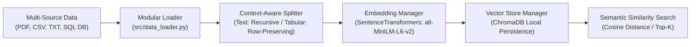

# 📚 Modular RAG Ingestion & Vector Retrieval Pipeline

A production-minded, modular **Retrieval-Augmented Generation (RAG)** pipeline implementation in Python. This foundational study project demonstrates how to ingest, validate, and chunk multi-source heterogenous data (PDFs, CSVs, plain text, and relational SQLite databases), generate high-dimensional semantic embeddings, and index them into local vector stores.

---

## 🎯 Project Highlights & Architecture



### Key Capabilities:
* **Multi-Source Data Ingestion (`src/data_loader.py`):** Custom modular loader designed to handle PDFs, text files, CSV tables, and SQLite database queries with built-in path validation and exception handling.
* **Smart Hybrid Chunking:** Implements `RecursiveCharacterTextSplitter` (`chunk_size=1000`, `chunk_overlap=200`) for unstructured text while dynamically preserving structured tabular rows (CSV/SQL) to prevent contextual fragmentation.
* **Embedding Model Lifecycle (`src/embedding_manager.py`):** Centralized embedding manager generating 384-dimensional dense semantic vectors via `SentenceTransformer` (`all-MiniLM-L6-v2`).
* **Vector Indexing & Local Storage (`src/vector_store.py`):** Indexes vectors locally using persistent `ChromaDB` storage executing cosine similarity queries.

---

## 📂 Sub-Project Directory Structure

```text
Modular_RAG_Pipeline/
├── Data/                  # Local storage for source documents & persistent vector DB
├── NoteBook/              
│   └── document.ipynb     # Interactive pipeline development & verification notebook
├── src/                   
│   ├── data_loader.py     # Modular ingestion module for PDFs, CSVs, TXT, & SQL DBs
│   ├── embedding_manager.py # SentenceTransformers embedding model manager
│   └── vector_store.py    # ChromaDB indexing & vector retrieval module
├── pyrightconfig.json     # Language Server environment sync config
├── requirements.txt       # Dependencies (LangChain, ChromaDB, SentenceTransformers)
├── SETUP_GUIDE.md         # Environment setup and troubleshooting documentation
└── RAG_TUTORIAL.md        # Technical reference guide & RAG pipeline breakdown
```

---

## 📖 Technical Documentation & Guides

* **⚙️ [Environment & Setup Guide](SETUP_GUIDE.md)**: Instructions for activating `rag_env`, resolving Linter errors, and Jupyter kernel registration.
* **📘 [RAG System Deep-Dive & Reference](RAG_TUTORIAL.md)**: Comprehensive architectural notes covering ingestion strategies, chunking math, embedding models, and vector database comparisons.

---

## 🚀 Quickstart & Notebook Execution

1. **Install Dependencies**:
   ```bash
   pip install -r requirements.txt
   ```

2. **Execute Ingestion & Search Pipeline**:
   Open [`NoteBook/document.ipynb`](NoteBook/document.ipynb) in Jupyter Notebook / VS Code, select your `rag_env` kernel, and run the pipeline cells.
