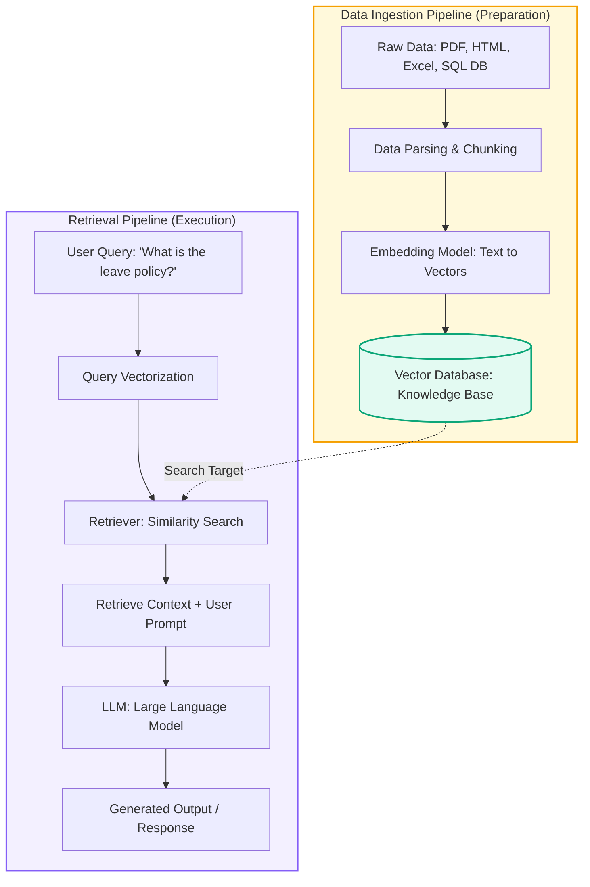
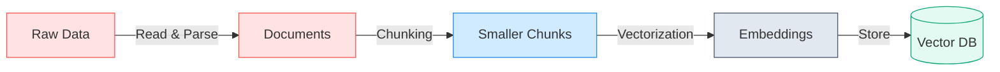
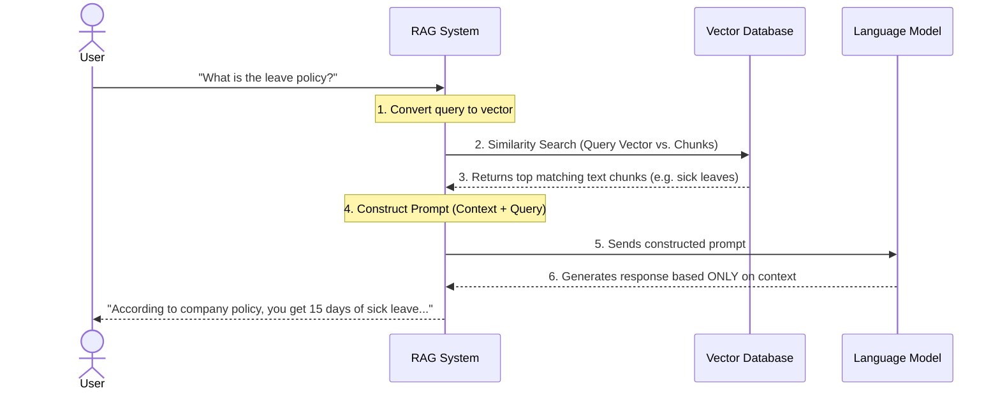

# Introduction to Retrieval-Augmented Generation (RAG)

Welcome! This guide is designed for beginners to understand **RAG (Retrieval-Augmented Generation)** from scratch. We will walk through the core concepts, compare it to other approaches like Fine-Tuning, and break down the two main pipelines—**Data Ingestion** and **Retrieval**—using clean visual diagrams and practical examples.

---

## 1. The Core Problem: Feeding Custom Data to LLMs

Imagine you run a startup. Your company has a wealth of private files:

* **HR Policies** (e.g., "What is the leave policy?")
* **Financial Documents** (e.g., quarterly expense reports)
* **Technical Wikis** (e.g., internal setup guides)

Standard Large Language Models (like GPT or Claude) don't know anything about your private data because they were trained on public internet data up to a specific date.

How do we solve this? There are three main paths:

| Approach                                       | How it works                                                                                                 | Pros                                                                                          | Cons                                                                         |
| :--------------------------------------------- | :----------------------------------------------------------------------------------------------------------- | :-------------------------------------------------------------------------------------------- | :--------------------------------------------------------------------------- |
| **Traditional Prompting**                | You copy-paste your entire manual into the chat prompt.                                                      | Simple, requires no setup.                                                                    | Context limits (cannot fit massive files), expensive token costs.            |
| **Fine-Tuning**                          | You retrain the model's weights on your private documents.                                                   | Good for teaching tone, style, or specific formatting rules.                                  | Highly expensive, slow, and becomes outdated the moment your policy changes. |
| **RAG (Retrieval-Augmented Generation)** | The model automatically searches an external database for relevant pages and reads them*before* answering. | **Real-time updates, cost-effective, highly accurate, and provides sources/citations.** | Requires building ingestion and retrieval pipelines.                         |

> [!NOTE]
> **RAG** acts like an **"Open-Book Exam"** for the AI. Instead of memorizing all information (Fine-Tuning) or trying to fit the entire library into a single prompt, the AI searches a catalog, finds the exact book and chapter it needs, reads it, and generates a grounded response.

---

## 2. Overall Architecture

Here is the high-level flow of a traditional RAG system, divided into the **Data Ingestion Pipeline** (on the left) and the **Retrieval Pipeline** (on the right):



---

## 3. Pipeline #1: Data Ingestion (The Preparation Phase)

Before the AI can answer any questions, we need to process our raw files and store them in a way the computer can search instantly. This is the **Data Ingestion Pipeline**.



### Step 1: Data Ingestion (Read Data)

We gather files in various formats—**PDFs, HTML web pages, Excel sheets, or SQL databases**—and read their contents into clean, raw text documents.

#### 💡 Practical Tutorial: Loading Multiple Source Formats in LangChain

In a real-world RAG system, you will often need to retrieve answers from different types of data sources simultaneously. LangChain simplifies this through dedicated **Document Loaders**. No matter the source format, every loader outputs a list of standard `Document` objects containing the text and metadata, making them easy to unify.

##### 1. The Setup: Imports

First, import the required loaders:

```python
from langchain_community.document_loaders import (
    PyMuPDFLoader,  # Fast PDF parsing
    TextLoader,      # Plain text & markdown files
    CSVLoader        # Tabular CSV data
)
from langchain_community.utilities import SQLDatabase
from langchain_community.document_loaders import SQLDatabaseLoader
```

##### 2. Loading Files & Databases

Here is how you ingest text from each format. Each `.load()` call returns a list of parsed LangChain `Document` objects.

* **PDF Documents:**

  ```python
  pdf_loader = PyMuPDFLoader("../Data/Embedding_Models.pdf")
  pdf_docs = pdf_loader.load()
  ```
* **Plain Text Files (`.txt` / `.md`):**

  ```python
  text_loader = TextLoader("../Data/company_policy.txt")
  text_docs = text_loader.load()
  ```
* **CSV Spreadsheets:**

  ```python
  csv_loader = CSVLoader(
      file_path="../Data/customer_data.csv",
      source_column="Customer_Feedback"  # Optional: specify primary content column
  )
  csv_docs = csv_loader.load()
  ```
* **SQL Databases:**

  ```python
  # Connect to the DB (e.g. SQLite)
  db = SQLDatabase.from_uri("sqlite:///../Data/my_company_db.db")

  # Fetch text fields using a query
  db_loader = SQLDatabaseLoader.from_query(
      query="SELECT first_name, last_name, customer_notes FROM customers;",
      db=db
  )
  db_docs = db_loader.load()
  ```

##### 3. Combining all Sources

To build a single unified RAG index, merge all lists of loaded documents into one master list before passing them to the text splitter:

```python
# Unify all sources into a single list
all_documents = []
all_documents.extend(pdf_docs)
all_documents.extend(text_docs)
all_documents.extend(csv_docs)
all_documents.extend(db_docs)

print(f"Total unified documents loaded: {len(all_documents)}")
```

#### 🛠️ Modular Ingestion: Creating a Reusable Data Loader Helper

In standard development, writing loader logic directly inside notebook cells can clutter your workflow. A best practice is to modularize the data ingestion code into a separate file inside a helper directory (like `src/data_loader.py`).

We have configured a modular helper [data_loader.py](<file:///Users/dilshanrajapakshe/Documents/SLIIT/GitHub/Data%20science/RAG/src/data_loader.py>) that encapsulates file existence validation, basic database connection safety, and returns a unified list of Document objects.

##### How to Import and Run it inside your Notebook:

```python
import sys
# Tell Python to search the parent folder for the 'src' package
sys.path.append("..") 

from src.data_loader import load_multi_source_data

# Simply pass lists of files and database details
all_documents = load_multi_source_data(
    pdf_files=["../Data/Embedding_Models.pdf"],
    text_files=["../Data/company_policy.txt"],
    csv_files=["../Data/customer_data.csv"],
    db_configs=[{"uri": "sqlite:///../Data/my_company_db.db", "query": "SELECT * FROM customers;"}]
)
```

### Step 2: Data Parsing & Chunking

Large Language Models (LLMs) have strict limits on how much text they can process in a single prompt (the context window). If we pass a 100-page document directly, the model might drop context, hallucinate, or become extremely expensive to run.

**Chunking** is the process of breaking long documents down into smaller, self-contained, and semantically logical pieces.

---

#### 🧠 Chunking Parameters Explained

When setting up a text splitter, you control two main variables:

1. **`chunk_size`**: The target maximum length of each chunk (typically measured in characters or tokens).
   * *Small Chunks (e.g., 200 chars):* Highly specific, but might miss broader context.
   * *Large Chunks (e.g., 2000 chars):* Rich context, but might dilute the specific answer or waste LLM tokens.
   * *Sweet Spot:* `1000` characters (~150 to 200 words).
2. **`chunk_overlap`**: The amount of text shared between consecutive chunks.
   * *Purpose:* Prevents context from being sliced in half. If a key sentence happens to start at the split border, the overlap ensures it is captured completely in both chunks.
   * *Standard Practice:* $10\%$ to $20\%$ of the chunk size (e.g., `200` characters of overlap for a `1000` size).

---

#### ⚖️ The Dilemma: Structured vs. Unstructured Data

A common mistake in RAG architecture is applying the exact same chunking strategy to all document types.

* **Unstructured Data (PDFs, TXT, MD):** Requires standard chunking. Since sentences flow continuously across pages, we must split them into segments (like `RecursiveCharacterTextSplitter`) to index them correctly.
* **Structured/Tabular Data (CSVs, SQL Database Rows):** **Should NOT be split.** A single row in a CSV or database represents a complete, self-contained record (e.g., user feedback, product specs). Running a row through a text splitter might sever the relationship (like separating a customer's ID from their review text), destroying the data's meaning.

---

#### 💡 Practical Tutorial: Mixed-Type Chunking In LangChain

To handle this cleanly in your pipeline, you can dynamically scan the `all_documents` list returned by your loader, split the PDFs/Texts, and bypass the splitter for your CSVs/DB rows.

##### The Code to Run in Your Notebook:
```python
from langchain_text_splitters import RecursiveCharacterTextSplitter

# 1. Initialize the splitter for unstructured files
text_splitter = RecursiveCharacterTextSplitter(
    chunk_size=1000,
    chunk_overlap=200
)

# 2. Categorize documents dynamically
unstructured_docs = []
structured_docs = []

for doc in all_documents:
    # Read the file path/type from the metadata
    source = doc.metadata.get("source", "").lower()
    
    # If the file is a PDF, Text file, or Markdown, separate it for splitting
    if source.endswith(".pdf") or source.endswith(".txt") or source.endswith(".md"):
        unstructured_docs.append(doc)
    else:
        # Keep CSV rows and Database records intact
        structured_docs.append(doc)

# 3. Apply the splitter only to the unstructured documents
split_chunks = text_splitter.split_documents(unstructured_docs)

# 4. Merge split chunks with the untouched structured documents
final_chunks = split_chunks + structured_docs

print(f"Original documents loaded: {len(all_documents)}")
print(f"Unstructured documents split into {len(split_chunks)} chunks")
print(f"Structured items kept unsplit: {len(structured_docs)}")
print(f"Total unified chunks ready for Vector DB: {len(final_chunks)}")
```

---

### Step 3: Embedding (Text $\rightarrow$ Vectors)

Computers cannot perform semantic similarity matching using raw text strings alone. We must convert human-readable text chunks into numerical representations that computers can analyze mathematically.

* An **Embedding Model** is a neural network that translates text chunks into a high-dimensional list of numbers, called a **Vector**.
* **Semantic Space & Dimensions:** Every vector has a set length (dimensions). For example, a lightweight model might output a list of `384` numbers per chunk, while OpenAI's models output `1536` or `3072` numbers. More dimensions allow the model to capture deeper context but require more memory/compute.
* **Semantic Similarity:** The vector represents the text's core meaning. If we project vectors onto a mathematical coordinate system, topics with similar concepts (e.g., "annual leave" and "time off") will sit physically close to each other. We use formulas like **Cosine Similarity** to calculate the distance/angle between them to retrieve the most relevant content.

#### 📊 Popular Embedding Model Options

| Embedding Model | Type | Pros | Cons | Best Suited For |
| :--- | :--- | :--- | :--- | :--- |
| **Google Gemini (`models/gemini-embedding-001`)** | Cloud API (Google AI) | Highly accurate 768-dim vectors, multilingual, fast, free tier via Google AI Studio. | Requires API Key (`GOOGLE_API_KEY`), internet connection. | **Cloud RAG pipelines, production-grade applications**. |
| **Hugging Face (`all-MiniLM-L6-v2`)** | Open Source (Local) | $100\%$ free, runs entirely offline (complete data privacy), fast on standard CPUs. | Uses local RAM/CPU, 384-dim (slightly lower reasoning than large API models). | **Learning, Tutorials, & Local Offline Prototypes**. |
| **OpenAI (`text-embedding-3-small` / `large`)** | Cloud API (Paid) | Industry standard accuracy, handles multiple languages, zero local resource overhead. | Requires active internet, cost per token, data privacy concerns. | Production applications, fast prototyping. |

---

### 🛡️ Engineering Best Practice: Modular Abstraction & Secure API Keys

When moving beyond basic prototypes, hardcoding model-specific code directly in notebook cells creates tight coupling. A best practice is to use **Object-Oriented Abstraction**:

1. **The Abstraction Pattern (`src/embedding_manager.py`)**: Wrap your embedding logic inside a class called `EmbeddingManager`. The rest of your RAG pipeline only calls `embedder.generate_embedding(text)`. It doesn't care whether the vector comes from a local CPU model or Google Cloud APIs!
2. **Secure API Key Management (`.env` file)**:
   * **Rule #1:** Never hardcode secret API keys (like `GOOGLE_API_KEY`) inside code files.
   * **Rule #2:** Store secrets in a local `.env` file and exclude `.env` from Git via `.gitignore`.
   * **Rule #3:** Use `python-dotenv` to load keys into environment variables safely at runtime.

---

### Step 4: Storing in a Vector Database

Once we convert our text chunks into vectors, we need a way to store them securely and query them instantly. Traditional relational databases (like SQL) are optimized for matching keywords exactly, making them inefficient for finding semantic similarities. 

A **Vector Database** is a specialized database built to organize, store, and query high-dimensional vectors. It indexes the vectors and performs **Approximate Nearest Neighbor (ANN)** searches to find match candidates in milliseconds.

#### 📊 Popular Vector Database Options

| Vector Database | Architecture | Pros | Cons | Best Suited For |
| :--- | :--- | :--- | :--- | :--- |
| **ChromaDB** | Local / In-Memory | **Incredibly simple (Recommended)**. Runs directly inside your Jupyter Notebook, saves as a local folder, zero setup. | Not built for millions of entries or high production scale. | **Local learning, sandbox environments, and notebook scripts**. |
| **FAISS (by Meta)** | Local / Index | Extremely fast, lightweight local library for mathematical search vectors. | Lacks standard database features (easy CRUD operations, metadata filtering). | Highly optimized local similarity indexes. |
| **Pinecone** | Cloud / SaaS | Managed cloud infrastructure, handles millions of vectors at scale, nice web console dashboard. | Requires an API key, relies on active internet, monthly charges. | Enterprise deployments, production-grade cloud RAG pipelines. |
| **pgvector (PostgreSQL)** | SQL Extension | Lets you keep vectors directly next to regular relational tables in standard Postgres. | Requires hosting a full PostgreSQL database. | Teams that want to leverage their existing database setup. |

> [!TIP]
> **Recommended Sandbox Stack for Beginners:**
> For learning and building your first RAG system, you can start with **Local Hugging Face (`all-MiniLM-L6-v2`)** for offline zero-cost development, and easily switch to **Google Gemini (`models/gemini-embedding-001`)** via your `.env` key when ready!

---

#### 💡 Practical Tutorial: Setup & Modular Imports for Embeddings & Vector DB

To implement this phase cleanly, we use our modular `EmbeddingManager` ([src/embedding_manager.py](file:///Users/dilshanrajapakshe/Documents/SLIIT/GitHub/Data%20science/RAG/src/embedding_manager.py)) alongside ChromaDB storage:

##### 1. Python Imports & Dependencies Explained

```python
import uuid
from typing import List, Dict, Any, Tuple

import numpy as np
import chromadb
from chromadb.config import Settings
from sklearn.metrics.pairwise import cosine_similarity
from src.embedding_manager import EmbeddingManager
```

* **`numpy`**: Provides fast array operations for vector math.
* **`EmbeddingManager`**: Our custom OOP class supporting both local (`SentenceTransformer`) and cloud (`Google Gemini`) providers.
* **`chromadb`**: The local vector database engine that persists chunks, vectors, and metadata in a folder.
* **`Settings`**: Configures ChromaDB behavior (e.g. database path, telemetry settings).
* **`uuid`**: Generates unique IDs (e.g. `uuid.uuid4()`) so every stored vector chunk has a distinct key in the database.
* **`cosine_similarity`**: Computes mathematical similarity scores between pairs of vectors.

##### 2. Multi-Provider Initialization Examples

###### Option A: Using Local Offline Embeddings ($100\%$ Free & Offline)
```python
# Initialize local HuggingFace embedding manager
embedder = EmbeddingManager(provider="local")

# Generate a sample 384-dimensional vector
sample_vector = embedder.generate_embedding("What is the company leave policy?")
print(f"Local Vector Length (Dimensions): {len(sample_vector)}") # Output: 384
```

###### Option B: Using Google Gemini Pro / AI Studio API
Make sure `GOOGLE_API_KEY=AIzaSy...` is set in your `.env` file first:
```python
# Initialize Google Gemini embedding manager
embedder = EmbeddingManager(provider="google")

# Generate a sample 768-dimensional vector
sample_vector = embedder.generate_embedding("What is the company leave policy?")
print(f"Google Gemini Vector Length (Dimensions): {len(sample_vector)}") # Output: 768
```

##### 3. Initializing Local ChromaDB Storage
```python
# Initialize local ChromaDB persistent storage
chroma_client = chromadb.PersistentClient(path="../Data/chroma_db")
collection = chroma_client.get_or_create_collection(name="rag_documents")

print("✅ Vector DB & Multi-Provider Embedding Manager initialized successfully!")
```

---

## 4. Pipeline #2: Retrieval & Generation (The Action Phase)

Once our Knowledge Base is set up, we are ready to answer queries in real-time. This is the **Retrieval Pipeline**.



### Step 1: User Query

The user asks a question, for example: *"What is the leave policy?"*

### Step 2: Query Embedding

The system sends the user's query to the **same embedding model** used during data ingestion. The query text is converted into a query vector.

### Step 3: Similarity Search (The Retriever)

The system performs a **Similarity Search** matching the query vector against all vectors in the Vector Database. It finds the chunks whose vectors are mathematically closest to the query vector.

* *Result:* The database returns the chunks discussing leaves, while ignoring irrelevant chunks about expense reporting or engineering setup.

### Step 4: Constructing the Prompt

The system fetches the actual text of the retrieved chunks (the **Context**) and combines it with the user's original query into a structured template called a **Prompt**.

```
[SYSTEM PROMPT]
You are a helpful HR Assistant. Answer the question using ONLY the context provided below.

[CONTEXT]
- Employees are entitled to 15 paid annual leave days and 5 sick leave days per year.
- Maternity leave is 12 weeks fully paid.

[USER QUERY]
What is the leave policy?
```

### Step 5: LLM Generation

The constructed prompt is sent to the LLM. Because the prompt contains the exact correct answer in the **Context**, the LLM can generate a highly accurate, grounded, and factual response, avoiding hallucinations.

---

## 5. Summary Checklist for Beginners

To build a basic RAG system, you will need:

1. **Data Source**: Your raw files (PDFs, Markdown, database records).
2. **Parser/Loader**: Tools to read text from files (e.g., PyPDF, LangChain document loaders).
3. **Chunker**: Strategies to break text down (e.g., character text splitters, recursive splitters).
4. **Embedding Model**: API or local model to convert text to vectors (e.g., OpenAI embeddings, HuggingFace SentenceTransformers).
5. **Vector DB**: A database to store vectors and perform similarity searches.
6. **LLM**: A model to read the retrieved context and write the final response.

### **6.Quick Recap**

LLMs don't inherently know your private, updated data → this is the core problem.
Fine-tuning changes the model itself; RAG keeps the model unchanged but feeds it relevant info at query time.
RAG has two pipelines:

Data Ingestion Pipeline: Raw Data → Parsing → Chunking → Embedding → Vector DB (done once / on updates)
Retrieval Pipeline: Query → Embed → Similarity Search → Context → Prompt → LLM → Output (done per question)

Embeddings turn text into vectors that capture meaning, enabling similarity search.
This setup is called Traditional RAG — the foundation for more advanced RAG techniques.
