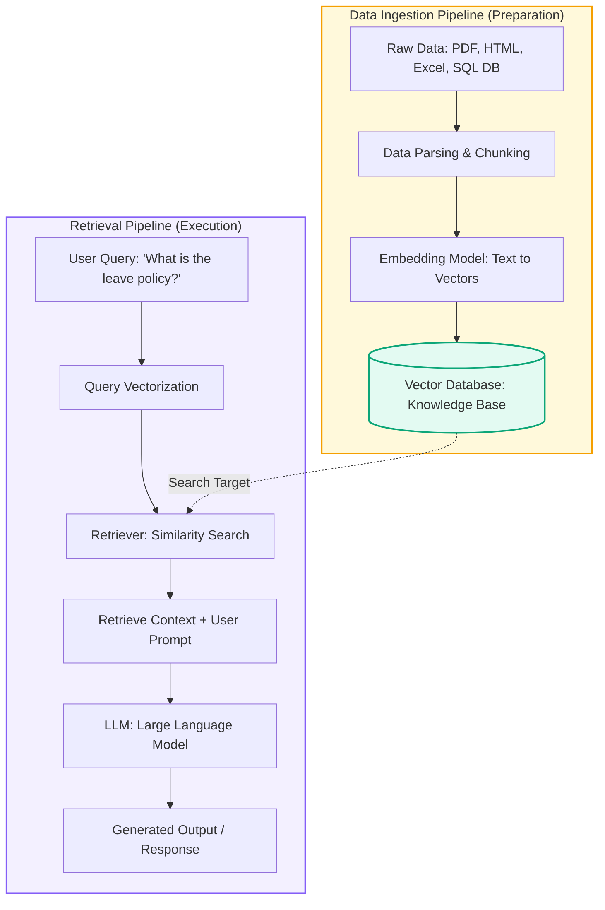
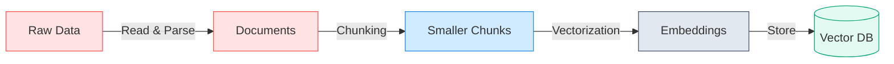
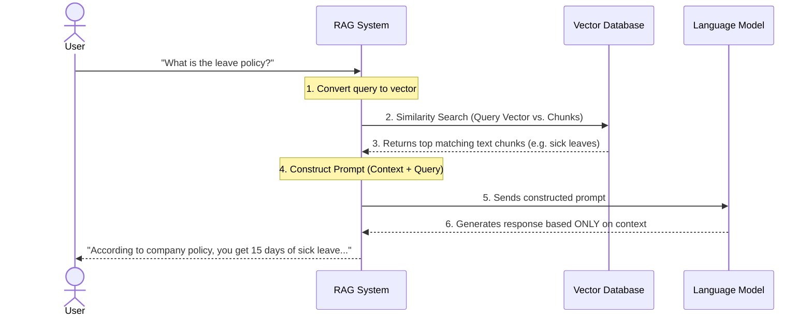

# Introduction to Retrieval-Augmented Generation (RAG)

Welcome! This guide is designed for beginners to understand **RAG (Retrieval-Augmented Generation)** from scratch. We will walk through the core concepts, compare it to other approaches like Fine-Tuning, and break down the two main pipelines—**Data Ingestion** and **Retrieval**—using clean visual diagrams and practical examples.

---

## 1. The Core Problem: Feeding Custom Data to LLMs

Imagine you run a startup. Your company has a wealth of private files:

* **HR Policies** (e.g., "What is the leave policy?")
* **Financial Documents** (e.g., quarterly expense reports)
* **Technical Wikis** (e.g., internal setup guides)

Standard Large Language Models (like GPT or Claude) don't know anything about your private data because they were trained on public internet data up to a specific date.

How do we solve this? There are three main paths:

| Approach                                       | How it works                                                                                                 | Pros                                                                                          | Cons                                                                         |
| :--------------------------------------------- | :----------------------------------------------------------------------------------------------------------- | :-------------------------------------------------------------------------------------------- | :--------------------------------------------------------------------------- |
| **Traditional Prompting**                | You copy-paste your entire manual into the chat prompt.                                                      | Simple, requires no setup.                                                                    | Context limits (cannot fit massive files), expensive token costs.            |
| **Fine-Tuning**                          | You retrain the model's weights on your private documents.                                                   | Good for teaching tone, style, or specific formatting rules.                                  | Highly expensive, slow, and becomes outdated the moment your policy changes. |
| **RAG (Retrieval-Augmented Generation)** | The model automatically searches an external database for relevant pages and reads them*before* answering. | **Real-time updates, cost-effective, highly accurate, and provides sources/citations.** | Requires building ingestion and retrieval pipelines.                         |

> [!NOTE]
> **RAG** acts like an **"Open-Book Exam"** for the AI. Instead of memorizing all information (Fine-Tuning) or trying to fit the entire library into a single prompt, the AI searches a catalog, finds the exact book and chapter it needs, reads it, and generates a grounded response.

---

## 2. Overall Architecture

Here is the high-level flow of a traditional RAG system, divided into the **Data Ingestion Pipeline** (on the left) and the **Retrieval Pipeline** (on the right):



---

## 3. Pipeline #1: Data Ingestion (The Preparation Phase)

Before the AI can answer any questions, we need to process our raw files and store them in a way the computer can search instantly. This is the **Data Ingestion Pipeline**.



### Step 1: Data Ingestion (Read Data)

We gather files in various formats—**PDFs, HTML web pages, Excel sheets, or SQL databases**—and read their contents into clean, raw text documents.

### Step 2: Data Parsing & Chunking

LLMs have limits on how much text they can process at once. If we feed a 500-page document, the model might get confused or run out of memory.

* **Chunking** splits long documents into smaller, logical pieces (e.g., 500-character segments or paragraph-sized pieces).
* *Example:* An HR PDF is split into separate chunks: Chunk 1 covers *Sick Leaves*, Chunk 2 covers *Annual Leaves*, and Chunk 3 covers *Maternity Leaves*.

### Step 3: Embedding (Text $\rightarrow$ Vectors)

Computers cannot easily compute similarity using words alone. We must convert text chunks into numbers.

* An **Embedding Model** translates text chunks into lists of numbers (called **Vectors**).
* These vectors capture the **semantic meaning** of the text. Chunks with similar topics (e.g., "vacation days" and "annual leave") will have vectors that sit close together in mathematical space.

### Step 4: Storing in a Vector Database

These vectors are saved inside a specialized database (like Pinecone, Chroma, pgvector, or Milvus). This becomes our searchable **Knowledge Base**.

---

## 4. Pipeline #2: Retrieval & Generation (The Action Phase)

Once our Knowledge Base is set up, we are ready to answer queries in real-time. This is the **Retrieval Pipeline**.



### Step 1: User Query

The user asks a question, for example: *"What is the leave policy?"*

### Step 2: Query Embedding

The system sends the user's query to the **same embedding model** used during data ingestion. The query text is converted into a query vector.

### Step 3: Similarity Search (The Retriever)

The system performs a **Similarity Search** matching the query vector against all vectors in the Vector Database. It finds the chunks whose vectors are mathematically closest to the query vector.

* *Result:* The database returns the chunks discussing leaves, while ignoring irrelevant chunks about expense reporting or engineering setup.

### Step 4: Constructing the Prompt

The system fetches the actual text of the retrieved chunks (the **Context**) and combines it with the user's original query into a structured template called a **Prompt**.

```
[SYSTEM PROMPT]
You are a helpful HR Assistant. Answer the question using ONLY the context provided below.

[CONTEXT]
- Employees are entitled to 15 paid annual leave days and 5 sick leave days per year.
- Maternity leave is 12 weeks fully paid.

[USER QUERY]
What is the leave policy?
```

### Step 5: LLM Generation

The constructed prompt is sent to the LLM. Because the prompt contains the exact correct answer in the **Context**, the LLM can generate a highly accurate, grounded, and factual response, avoiding hallucinations.

---

## 5. Summary Checklist for Beginners

To build a basic RAG system, you will need:

1. **Data Source**: Your raw files (PDFs, Markdown, database records).
2. **Parser/Loader**: Tools to read text from files (e.g., PyPDF, LangChain document loaders).
3. **Chunker**: Strategies to break text down (e.g., character text splitters, recursive splitters).
4. **Embedding Model**: API or local model to convert text to vectors (e.g., OpenAI embeddings, HuggingFace SentenceTransformers).
5. **Vector DB**: A database to store vectors and perform similarity searches.
6. **LLM**: A model to read the retrieved context and write the final response.

### **6.Quick Recap**

LLMs don't inherently know your private, updated data → this is the core problem.
Fine-tuning changes the model itself; RAG keeps the model unchanged but feeds it relevant info at query time.
RAG has two pipelines:

Data Ingestion Pipeline: Raw Data → Parsing → Chunking → Embedding → Vector DB (done once / on updates)
Retrieval Pipeline: Query → Embed → Similarity Search → Context → Prompt → LLM → Output (done per question)

Embeddings turn text into vectors that capture meaning, enabling similarity search.
This setup is called Traditional RAG — the foundation for more advanced RAG techniques.
