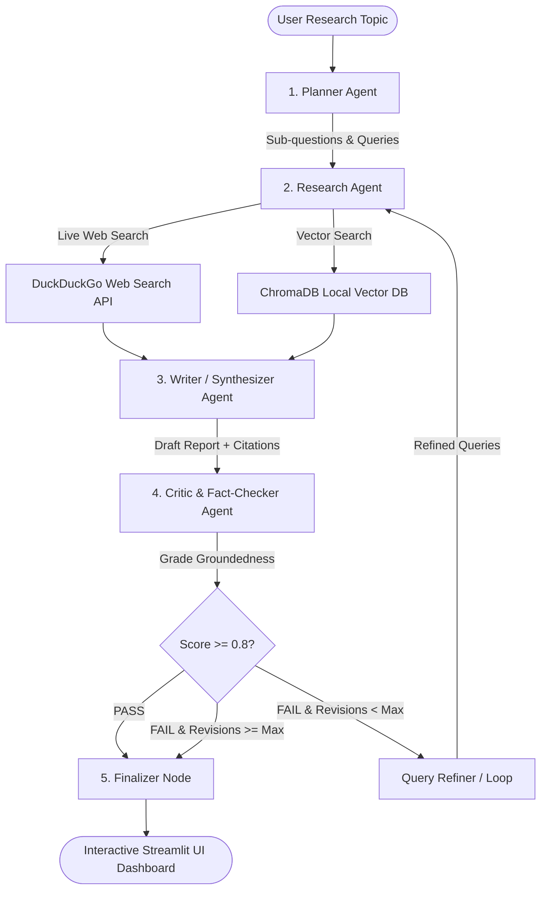
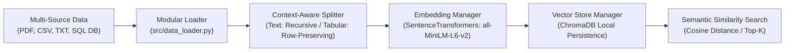

# ⚡ Advanced RAG & Multi-Agent Systems Engineering Portfolio

A production-minded, full-stack AI engineering repository demonstrating the architectural evolution from **heterogeneous data ingestion & vector retrieval pipelines** to **autonomous multi-agent state graphs with self-correction reflection loops**.

---

## 🎯 Executive Summary: Why This Portfolio Stands Out

Most AI projects are simple "single-prompt wrappers" (`Prompt + Vector Store -> LLM`). This repository showcases **Autonomous Systems Engineering**, demonstrating how to solve real-world AI challenges (hallucinations, static knowledge cutoffs, unverified facts, and structured data fragmentation):

1. **Heterogeneous RAG Data Ingestion:** Parsing and chunking multi-source data (PDFs, CSVs, plain text, and SQLite relational databases) while preserving tabular context.
2. **Stateful Multi-Agent Orchestration:** Using **LangGraph** to build cyclic state graphs with deterministic state mutability (`ResearchState`).
3. **Automated Self-Correction & Reflection:** Using a dedicated Critic Agent with **Pydantic v2** structured output schemas to grade groundedness (`0.0 - 1.0`) and trigger dynamic re-querying.
4. **Hybrid Dense-Sparse Retrieval:** Combining dense vector semantic search (`ChromaDB`) with real-time web search APIs (`DuckDuckGo`).
5. **Production Observability:** Full execution tracing and trajectory visualization via **LangSmith**.

---

## 📂 Repository Architecture & Sub-Projects

```text
RAG/
│
├── 🤖 Agentic_Research_Assistant/      # FEATURED: Autonomous Multi-Agent StateGraph Engine
│   ├── 📄 README.md                    # Sub-project documentation
│   ├── 📘 AGENTIC_TUTORIAL.md          # Complete technical tutorial & code breakdown
│   ├── ⚙️ config.py                     # Central Gemini LLM settings & parameters
│   ├── 📄 requirements.txt             # LangGraph, Gemini, ChromaDB, Pydantic dependencies
│   ├── 🔑 .env.example                 # API key setup template
│   ├── 🖥️ app.py                       # Interactive Streamlit UI dashboard
│   └── 🧩 src/
│       ├── state.py                    # Shared TypedDict ResearchState graph schema
│       ├── tools/                      # Hybrid retrieval (ChromaDB vector store + DuckDuckGo search)
│       └── agents/                     # Planner, Writer, Critic, & Graph Orchestrator
│
└── 📚 Modular_RAG_Pipeline/           # STUDY PROJECT: Fundamental RAG Ingestion & Vector Retrieval
    ├── 📄 README.md                    # Sub-project documentation
    ├── 📘 RAG_TUTORIAL.md              # RAG math & retrieval deep-dive reference
    ├── ⚙️ SETUP_GUIDE.md                # Environment & linter setup guide
    ├── 📄 requirements.txt             # Basic RAG dependencies (SentenceTransformers, ChromaDB)
    ├── 📓 NoteBook/
    │   └── document.ipynb              # Interactive pipeline verification notebook
    ├── 📁 Data/                        # Test datasets (PDFs, CSVs, SQL DB) & persistent vector index
    └── 🧩 src/                         # Core python modules (data_loader, embedding_manager, vector_store)
```

---

## 🤖 Sub-Project 1: Agentic Research Assistant (Featured System)

📁 **[Explore Agentic Sub-Project](Agentic_Research_Assistant/)** \| 📘 **[Read Deep-Dive Agentic Tutorial](Agentic_Research_Assistant/AGENTIC_TUTORIAL.md)**

### System Overview & Problem Solved

Single-prompt LLMs fail complex technical research tasks because they suffer from knowledge cutoffs, make unsupported assumptions, and cannot self-correct. The **Agentic Research Assistant** deploys an autonomous network of specialized AI agents over a cyclic state graph:


```mermaid
graph TD
    User([User Research Topic]) --> Planner[1. Planner Agent]
    Planner -->|Sub-questions & Queries| Research[2. Research Agent]
  
    Research -->|Live Web Search| DDG[DuckDuckGo Web Search API]
    Research -->|Vector Search| ChromaDB[ChromaDB Local Vector DB]
  
    DDG --> Writer[3. Writer / Synthesizer Agent]
    ChromaDB --> Writer
  
    Writer -->|Draft Report + Citations| Critic[4. Critic & Fact-Checker Agent]
  
    Critic -->|Grade Groundedness| Evaluator{Score >= 0.8?}
  
    Evaluator -->|PASS| Finalizer[5. Finalizer Node]
    Evaluator -->|FAIL & Revisions < Max| Refiner[Query Refiner / Loop]
    Refiner -->|Refined Queries| Research
    Evaluator -->|FAIL & Revisions >= Max| Finalizer
  
    Finalizer --> Output([Interactive Streamlit UI Dashboard])
```

### Agent Roles & Key Technical Implementations

| Agent Node                  | Functionality                                                                                                | Key AI Engineering Concept                                             |
| :-------------------------- | :----------------------------------------------------------------------------------------------------------- | :--------------------------------------------------------------------- |
| **1. Planner Agent**  | Decomposes broad topics into 4 targeted sub-questions and search engine queries.                             | Task Decomposition & Pydantic Structured Output (`PlannerOutput`)    |
| **2. Research Agent** | Executes parallel queries across local vector store and live web search.                                     | Hybrid Dense Vector & Live API Retrieval                               |
| **3. Writer Agent**   | Synthesizes retrieved evidence into a structured markdown report.                                            | Inline Citation Generation (`[1]`, `[2]`) & Fact Grounding         |
| **4. Critic Agent**   | Evaluates report against evidence, assigns groundedness score (`0.0 - 1.0`), and identifies missing facts. | Automated Reflection & Hallucination Guardrails (`CriticEvaluation`) |
| **5. Query Refiner**  | Dynamically rewrites search queries if`score < 0.8` and re-triggers retrieval.                             | Cyclic Graph Reflection Loop (`should_continue`)                     |

---

## 📚 Sub-Project 2: Modular RAG Ingestion Pipeline (Study Project)

📁 **[Explore Modular RAG Sub-Project](Modular_RAG_Pipeline/)** \| 📘 **[Read RAG Deep-Dive Tutorial](Modular_RAG_Pipeline/RAG_TUTORIAL.md)**

### System Overview & Problem Solved

Standard naive RAG pipelines break when handling heterogeneous real-world data (PDFs, plain text, CSV tables, and relational SQL databases) because arbitrary character splitting fragments table rows and destroys relational context.

This sub-project implements a modular, production-minded ingestion and indexing engine designed to handle multi-format heterogenous data safely:


```mermaid
graph LR
    Sources["Multi-Source Data\n(PDF, CSV, TXT, SQL DB)"] --> Loader["Modular Loader\n(src/data_loader.py)"]
    Loader --> Chunker["Context-Aware Splitter\n(Text: Recursive / Tabular: Row-Preserving)"]
    Chunker --> Embedder["Embedding Manager\n(SentenceTransformers: all-MiniLM-L6-v2)"]
    Embedder --> VectorStore["Vector Store Manager\n(ChromaDB Local Persistence)"]
    VectorStore --> Search["Semantic Similarity Search\n(Cosine Distance / Top-K)"]
```

### Technical Highlights:

* **Heterogeneous Data Ingestion (`src/data_loader.py`):** Unified loader supporting `.pdf`, `.csv`, `.txt`, and SQLite database queries with path validation and exception handling.
* **Context-Aware Hybrid Chunking:** Uses `RecursiveCharacterTextSplitter` (`chunk_size=1000`, `chunk_overlap=200`) for unstructured text while preserving CSV/SQL rows intact.
* **Embedding Model Lifecycle (`src/embedding_manager.py`):** Wraps `SentenceTransformer` (`all-MiniLM-L6-v2`) generating 384-dimensional dense vector embeddings.
* **Vector Indexing & Retrieval (`src/vector_store.py`):** Local `ChromaDB` persistent storage executing top-$k$ semantic similarity queries.
* **Interactive Notebook Verification:** Complete execution and testing in [`NoteBook/document.ipynb`](Modular_RAG_Pipeline/NoteBook/document.ipynb).

---

## ⚡ Technical Comparison: Evolution of Architectural Approaches

| Architectural Dimension         | Naive RAG                | Advanced Modular RAG               | Multi-Agent State Graphs (This Repo)        |
| :------------------------------ | :----------------------- | :--------------------------------- | :------------------------------------------ |
| **Pipeline Flow**         | Fixed Linear DAG         | Modular Sequential Components      | Cyclic Graph with Dynamic Edge Routing      |
| **Data Ingestion**        | Unstructured text only   | Heterogeneous (PDF, CSV, TXT, SQL) | Hybrid (PDF RAG + Live Web APIs)            |
| **State Mutability**      | Stateless string passing | Single component state             | Shared Graph State (`TypedDict`)          |
| **Hallucination Control** | ❌ None                  | ⚠️ Static Context Grounding      | ✅ Automated Critic Reflection Loops        |
| **Output Type**           | Raw LLM Text             | Contextual Chunks                  | Pydantic Validated JSON & Cited Markdown    |
| **Observability**         | Console Print statements | Basic logging                      | **LangSmith** Full Trajectory Tracing |

---

## 🚀 Quickstart Guide: How to Run

### 1. Run the Featured Agentic Research Assistant

```bash
# Navigate to the Agentic project
cd Agentic_Research_Assistant

# Install dependencies
pip install -r requirements.txt

# Create .env file and set your Google Gemini API Key
cp .env.example .env
# Edit .env and add: GOOGLE_API_KEY=your_gemini_api_key

# Launch Streamlit Interactive UI
streamlit run app.py
```

### 2. Run the Modular RAG Study Pipeline

```bash
# Navigate to the Modular RAG project
cd Modular_RAG_Pipeline

# Install dependencies
pip install -r requirements.txt

# Open the verification notebook in Jupyter / VS Code
jupyter notebook NoteBook/document.ipynb
```

---

## 📖 Deep-Dive Documentation Links

* 📘 **[Agentic Multi-Agent Deep-Dive Tutorial](Agentic_Research_Assistant/AGENTIC_TUTORIAL.md)** — Complete breakdown of LangGraph state graphs, Pydantic schemas, reflection loops, and top 4 interview questions.
* 📘 **[Modular RAG Technical Reference Guide](Modular_RAG_Pipeline/RAG_TUTORIAL.md)** — In-depth guide on heterogeneous loaders, chunking math, embedding models, and vector database comparisons.
* ⚙️ **[Environment &amp; Setup Guide](Modular_RAG_Pipeline/SETUP_GUIDE.md)** — Setup instructions, Conda environment configuration, and linter sync.
