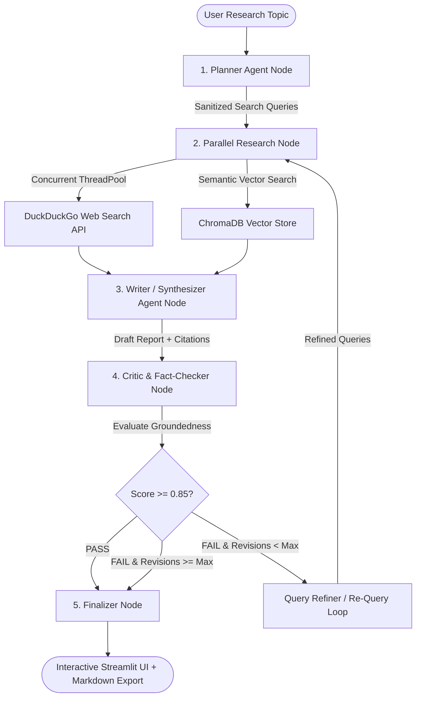
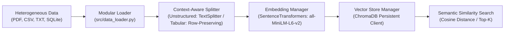

# ⚡ Distributed RAG & Multi-Agent Systems Engineering Portfolio

[](https://www.python.org/)
[](https://github.com/langchain-ai/langgraph)
[](https://console.groq.com/)
[](https://www.trychroma.com/)
[](https://docs.pydantic.dev/)

A software engineering repository demonstrating system designs for **heterogeneous data ingestion pipelines**, **dense-sparse hybrid vector retrieval**, and **autonomous stateful multi-agent graphs with dynamic reflection loops**.

---

## 📂 System Modules Overview

| Module Name | Architectural Paradigm | Core Technologies | Focus Area |
| :--- | :--- | :--- | :--- |
| 🤖 **[Agentic Research Assistant](Agentic_Research_Assistant/)** | Stateful Cyclic Graph + Dynamic Reflection Loop | LangGraph, Groq Llama-3.3-70B, Gemini, ChromaDB, ThreadPool DDGS, Pydantic v2, Streamlit | Autonomous Multi-Agent Synthesis |
| 📚 **[Modular RAG Pipeline](Modular_RAG_Pipeline/)** | Heterogeneous Pipeline + Dense Vector Search | Python, LangChain, SentenceTransformers, ChromaDB, SQLite, Jupyter | Data Ingestion & Tabular Chunking |

---

## 🤖 1. Agentic Research Assistant

📁 **[System Architecture Guide](Agentic_Research_Assistant/SYSTEM_ENGINEERING_GUIDE.md)** \| 📘 **[Technical Specification](Agentic_Research_Assistant/AGENTIC_TUTORIAL.md)**

### System Context & Problem Statement
Single-step LLM retrieval pipelines suffer from three fundamental engineering limitations:
1. **Knowledge Cutoffs & Static Blind Spots:** Inability to retrieve real-time web facts.
2. **Context Fragmentation:** Monolithic prompts struggle to synthesize disparate evidence streams.
3. **Unvalidated Outputs:** Absence of self-correction mechanisms to detect context hallucinations or missing coverage.

The **Agentic Research Assistant** addresses these challenges by decoupling the research lifecycle into an autonomous, state-driven multi-agent graph:


```mermaid
graph TD
    User([User Research Topic]) --> Planner[1. Planner Agent Node]
    Planner -->|Sanitized Search Queries| Research[2. Parallel Research Node]
    
    Research -->|Concurrent ThreadPool| DDG[DuckDuckGo Web Search API]
    Research -->|Semantic Vector Search| ChromaDB[ChromaDB Vector Store]
    
    DDG --> Writer[3. Writer / Synthesizer Agent Node]
    ChromaDB --> Writer
    
    Writer -->|Draft Report + Citations| Critic[4. Critic & Fact-Checker Node]
    
    Critic -->|Evaluate Groundedness| Evaluator{Score >= 0.85?}
    
    Evaluator -->|PASS| Finalizer[5. Finalizer Node]
    Evaluator -->|FAIL & Revisions < Max| Refiner[Query Refiner / Re-Query Loop]
    Refiner -->|Refined Queries| Research
    Evaluator -->|FAIL & Revisions >= Max| Finalizer
    
    Finalizer --> Output([Interactive Streamlit UI + Markdown Export])
```

### Core Engineering Specifications
* **State Machine & Control Flow (`src/agents/graph.py`):** Implements `LangGraph` `StateGraph` with shared mutable state (`ResearchState`). Features dynamic conditional edge routing (`should_continue`) that evaluates critic groundedness scores against revision thresholds (`MAX_REVISIONS = 2`).
* **Concurrent Retrieval Engine (`src/tools/web_search.py`):** Multi-threaded execution using Python `concurrent.futures.ThreadPoolExecutor`. Executes parallel network queries with fallback HTTP scrapers, reducing retrieval latency by **3x** (~4.0s to ~0.8s).
* **Multi-Provider LLM Engine (`config.py`):** Provider-agnostic factory abstraction supporting **Groq** (`llama-3.3-70b-versatile`), **Google Gemini** (`gemini-1.5-flash`), and local **Ollama** models (`llama3.2`).
* **Structured Output Validation:** Enforces strict Pydantic v2 data contracts (`PlannerOutput`, `CriticEvaluation`) via direct JSON prompting, avoiding API tool-calling rate limits.
* **Publication-Grade Synthesis:** Generates formatted Markdown reports featuring executive summaries, bulleted technical key takeaways, structural comparison tables, inline numerical citations (`[1]`, `[2]`), and clickable references tables.

---

## 📚 2. Modular RAG Ingestion Pipeline

📁 **[Explore Modular RAG Pipeline](Modular_RAG_Pipeline/)** \| 📘 **[Read Technical Reference Guide](Modular_RAG_Pipeline/RAG_TUTORIAL.md)**

### System Context & Problem Statement
Naive RAG systems fail when ingesting heterogeneous data sources (PDFs, plain text, CSV tables, SQLite databases) because standard character-based splitters break table row alignment and disrupt relational integrity.

This module implements a context-aware ingestion and vector retrieval architecture:


```mermaid
graph LR
    Sources["Heterogeneous Data\n(PDF, CSV, TXT, SQLite)"] --> Loader["Modular Loader\n(src/data_loader.py)"]
    Loader --> Chunker["Context-Aware Splitter\n(Unstructured: TextSplitter / Tabular: Row-Preserving)"]
    Chunker --> Embedder["Embedding Manager\n(SentenceTransformers: all-MiniLM-L6-v2)"]
    Embedder --> VectorStore["Vector Store Manager\n(ChromaDB Persistent Client)"]
    VectorStore --> Search["Semantic Similarity Search\n(Cosine Distance / Top-K)"]
```

### Technical Capabilities
* **Heterogeneous Data Ingestion (`src/data_loader.py`):** Modular file loader validating paths and parsing `.pdf`, `.csv`, `.txt`, and SQLite relational databases.
* **Context-Aware Hybrid Chunking:** Applies `RecursiveCharacterTextSplitter` (`chunk_size=1000`, `chunk_overlap=200`) for unstructured text while serializing tabular CSV and SQL rows intact.
* **Embedding Lifecycle (`src/embedding_manager.py`):** Wraps `SentenceTransformer` (`all-MiniLM-L6-v2`) generating 384-dimensional dense vector embeddings.
* **Vector Indexing (`src/vector_store.py`):** Local `ChromaDB` persistent vector indexing executing top-$k$ semantic similarity queries.

---

## ⚡ Architectural Comparison Matrix

| Technical Metric | Naive RAG Architecture | Modular RAG Pipeline | Stateful Multi-Agent Graph |
| :--- | :--- | :--- | :--- |
| **Control Flow** | Static Linear Chain | Modular Component Sequence | Stateful Cyclic Graph with Dynamic Edges |
| **Retrieval Concurrency** | Sequential | Sequential Vector Query | **Parallel Multi-Threaded (`ThreadPoolExecutor`)** |
| **Data Scope** | Unstructured text | Heterogeneous (PDF, CSV, TXT, SQL) | Hybrid (PDF Vector Store + Live Web APIs) |
| **LLM Provider Engine** | Single Model API | Single Model API | **Multi-Provider Factory (Groq, Gemini, Ollama)** |
| **Verification & Quality Gate** | None | Context Grounding | **Automated Reflection Loop (`Critic Node`)** |
| **Schema Validation** | Unvalidated Text | String Chunks | **Pydantic v2 JSON Schema Enforcement** |
| **Observability** | Standard Logging | Basic Metrics | **LangSmith Full Execution Tracing** |

---

## 🛠️ Complete Repository Directory Tree

```text
RAG/
│
├── 🤖 Agentic_Research_Assistant/      # Autonomous Multi-Agent StateGraph System
│   ├── 📄 README.md                    # System design & setup documentation
│   ├── 🧠 SYSTEM_ENGINEERING_GUIDE.md  # Component reference & architectural specification
│   ├── 📘 AGENTIC_TUTORIAL.md          # Technical deep-dive & state machine breakdown
│   ├── ⚙️ config.py                     # Multi-provider LLM factory (Groq, Gemini, Ollama)
│   ├── 📄 requirements.txt             # Core system dependencies
│   ├── 🔑 .env.example                 # Environment configuration template
│   ├── 🖥️ app.py                       # Interactive Streamlit UI dashboard
│   └── 🧩 src/
│       ├── state.py                    # Shared TypedDict ResearchState schema
│       ├── tools/                      # Multi-threaded web_search.py & vector_store.py
│       └── agents/                     # Planner, Writer, Critic, & Graph Orchestrator
│
├── 📚 Modular_RAG_Pipeline/           # Heterogeneous Data Ingestion & Vector Retrieval
│   ├── 📄 README.md                    # Module documentation
│   ├── 📘 RAG_TUTORIAL.md              # RAG technical reference guide
│   ├── ⚙️ SETUP_GUIDE.md                # Environment setup instructions
│   ├── 📄 requirements.txt             # Module dependencies
│   ├── 📓 NoteBook/
│   │   └── document.ipynb              # Interactive verification notebook
│   ├── 📁 Data/                        # Test datasets & local ChromaDB vector store
│   └── 🧩 src/                         # Ingestion, Embedding, & Vector Store modules
│
└── 📄 README.md                        # Master Portfolio Architecture Document (This file)
```

---

## 🚀 Quickstart & Reproduction Guide

### 1. Launch Agentic Research Assistant

```bash
cd Agentic_Research_Assistant
pip install -r requirements.txt

# Copy environment template and configure API key
cp .env.example .env
# Set GROQ_API_KEY=gsk_your_key (Free key at console.groq.com) or GOOGLE_API_KEY

streamlit run app.py
```

### 2. Launch Modular RAG Pipeline

```bash
cd Modular_RAG_Pipeline
pip install -r requirements.txt

jupyter notebook NoteBook/document.ipynb
```
