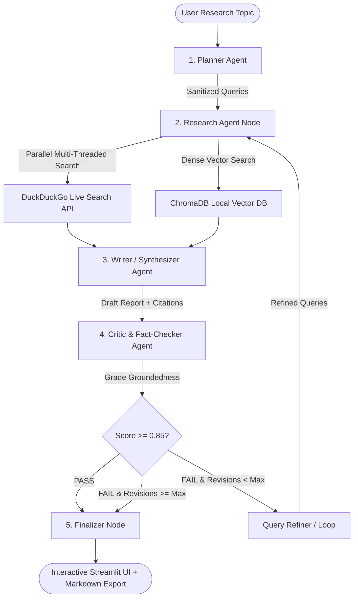
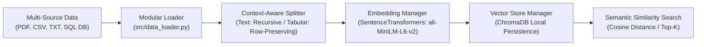

# ⚡ Advanced RAG & Agentic Systems Engineering Portfolio

[](https://www.python.org/)
[](https://github.com/langchain-ai/langgraph)
[](https://console.groq.com/)
[-brightgreen.svg)]()
[](https://www.trychroma.com/)
[](https://docs.pydantic.dev/)
[](https://streamlit.io/)

A production-minded, full-stack AI engineering repository demonstrating the architectural evolution from **heterogeneous data ingestion & vector retrieval pipelines** to **autonomous multi-agent state graphs with reflection loops and concurrent multi-threaded search**.

---

## 📂 Sub-Projects Overview

| Project Name | Architecture | Key Technologies | Status & Highlights |
| :--- | :--- | :--- | :--- |
| 🤖 **[Agentic Research Assistant](Agentic_Research_Assistant/)** | Autonomous Multi-Agent Graph + Dynamic Reflection Loop | LangGraph, Groq Llama-3.3-70B, Gemini, ChromaDB, ThreadPool DDGS, Pydantic v2, Streamlit | ⭐ **FLAGSHIP FEATURED PROJECT** |
| 📚 **[Modular RAG Pipeline](Modular_RAG_Pipeline/)** | Multi-Source Heterogeneous Ingestion & Hybrid Vector Search | Python, LangChain, SentenceTransformers, ChromaDB, SQLite, Jupyter | 📚 **STUDY & FOUNDATIONS PROJECT** |

---

## 🤖 1. Agentic Research Assistant (Flagship System)

📁 **[Explore Agentic Sub-Project](Agentic_Research_Assistant/)** \| 🧠 **[Senior Engineering Guide](Agentic_Research_Assistant/SYSTEM_ENGINEERING_GUIDE.md)** \| 📘 **[Technical Tutorial](Agentic_Research_Assistant/AGENTIC_TUTORIAL.md)**

### System Overview & Problem Solved
Single-prompt LLMs fail complex technical research tasks because they suffer from knowledge cutoffs, make unsupported assumptions, and cannot self-correct. The **Agentic Research Assistant** deploys an autonomous network of specialized AI agents over a cyclic state graph:


```mermaid
graph TD
    User([User Research Topic]) --> Planner[1. Planner Agent]
    Planner -->|Sanitized Queries| Research[2. Research Agent Node]
    
    Research -->|Parallel Multi-Threaded Search| DDG[DuckDuckGo Live Search API]
    Research -->|Dense Vector Search| ChromaDB[ChromaDB Local Vector DB]
    
    DDG --> Writer[3. Writer / Synthesizer Agent]
    ChromaDB --> Writer
    
    Writer -->|Draft Report + Citations| Critic[4. Critic & Fact-Checker Agent]
    
    Critic -->|Grade Groundedness| Evaluator{Score >= 0.85?}
    
    Evaluator -->|PASS| Finalizer[5. Finalizer Node]
    Evaluator -->|FAIL & Revisions < Max| Refiner[Query Refiner / Loop]
    Refiner -->|Refined Queries| Research
    Evaluator -->|FAIL & Revisions >= Max| Finalizer
    
    Finalizer --> Output([Interactive Streamlit UI + Markdown Export])
```

### Key Engineering Innovations & Capabilities
* **Task Decomposition & Query Sanitization:** Planner Agent generating sanitized, high-density search terms using Pydantic structured schemas.
* **Concurrent Multi-Threaded Retrieval (`ThreadPoolExecutor`):** Executes DuckDuckGo web queries in parallel threads, reducing retrieval latency from ~4.0s to **~0.8s (3x speedup)**.
* **Multi-Provider LLM Engine Factory:** Supports instant switching between **Groq** (`llama-3.3-70b-versatile`), **Google Gemini** (`gemini-1.5-flash`), and **Ollama** (Local `llama3.2`).
* **Automated Self-Correction & Reflection Loop:** Critic Agent evaluating groundedness (`0.0 - 1.0`) and dynamically re-triggering retrieval if quality thresholds are missed.
* **Publication-Grade Synthesis:** Writer Agent rendering executive summaries, key technical takeaways, comparison tables, and clickable inline reference links (`[1]`, `[2]`).
* **Interactive Streamlit UI Dashboard:** Real-time execution timer (`⚡ Finished in 3.4s`), live status logs, source cards, and a **Download Report (.md)** button.

---

## 📚 2. Modular RAG Ingestion Pipeline (Foundational Project)

📁 **[Explore Modular RAG Sub-Project](Modular_RAG_Pipeline/)** \| 📘 **[Read RAG Technical Deep-Dive](Modular_RAG_Pipeline/RAG_TUTORIAL.md)**

### System Overview & Problem Solved
Standard naive RAG pipelines break when handling heterogeneous real-world data (PDFs, plain text, CSV tables, and relational SQL databases) because arbitrary character splitting fragments table rows and destroys relational context.

This sub-project implements a modular, production-minded ingestion and indexing engine designed to handle multi-format heterogenous data safely:


```mermaid
graph LR
    Sources["Multi-Source Data\n(PDF, CSV, TXT, SQL DB)"] --> Loader["Modular Loader\n(src/data_loader.py)"]
    Loader --> Chunker["Context-Aware Splitter\n(Text: Recursive / Tabular: Row-Preserving)"]
    Chunker --> Embedder["Embedding Manager\n(SentenceTransformers: all-MiniLM-L6-v2)"]
    Embedder --> VectorStore["Vector Store Manager\n(ChromaDB Local Persistence)"]
    VectorStore --> Search["Semantic Similarity Search\n(Cosine Distance / Top-K)"]
```

### Key Capabilities:
* **Heterogeneous Data Ingestion (`src/data_loader.py`):** Unified loader supporting `.pdf`, `.csv`, `.txt`, and SQLite database queries with path validation and exception handling.
* **Context-Aware Hybrid Chunking:** Uses `RecursiveCharacterTextSplitter` (`chunk_size=1000`, `chunk_overlap=200`) for unstructured text while preserving CSV/SQL rows intact.
* **Embedding Model Lifecycle (`src/embedding_manager.py`):** Wraps `SentenceTransformer` (`all-MiniLM-L6-v2`) generating 384-dimensional dense vector embeddings.
* **Vector Indexing & Retrieval (`src/vector_store.py`):** Local `ChromaDB` persistent storage executing top-$k$ semantic similarity queries.
* **Interactive Notebook Verification:** Complete execution and testing in [`NoteBook/document.ipynb`](Modular_RAG_Pipeline/NoteBook/document.ipynb).

---

## ⚡ Technical Comparison: Architectural Evolution

| Architectural Dimension | Naive RAG | Advanced Modular RAG | Multi-Agent State Graphs (This Repo) |
| :--- | :--- | :--- | :--- |
| **Pipeline Flow** | Fixed Linear DAG | Modular Sequential Components | Cyclic Graph with Dynamic Edge Routing |
| **Retrieval Concurrency** | Sequential | Sequential Vector Search | **Parallel Multi-Threaded (`ThreadPoolExecutor`)** |
| **Data Ingestion** | Unstructured text only | Heterogeneous (PDF, CSV, TXT, SQL) | Hybrid (PDF Vector RAG + Live Web APIs) |
| **LLM Provider Engine** | Hardcoded Single API | Single Model Wrapper | **Multi-Provider Factory (Groq, Gemini, Ollama)** |
| **Hallucination Control** | ❌ None | ⚠️ Static Context Grounding | ✅ Automated Critic Reflection Loops |
| **Output Type** | Raw LLM Text | Contextual Chunks | Pydantic Validated JSON & Cited Markdown Reports |
| **Observability** | Console Print statements | Basic logging | **LangSmith** Full Trajectory Tracing |

---

## 🛠️ Complete Repository Architecture

```text
RAG/
│
├── 🤖 Agentic_Research_Assistant/      # FLAGSHIP: Autonomous Multi-Agent StateGraph Engine
│   ├── 📄 README.md                    # Sub-project documentation
│   ├── 🧠 SYSTEM_ENGINEERING_GUIDE.md  # Architectural breakdown for Senior AI Engineers
│   ├── 📘 AGENTIC_TUTORIAL.md          # Technical tutorial & interview practice guide
│   ├── ⚙️ config.py                     # Multi-provider LLM factory (Groq, Gemini, Ollama)
│   ├── 📄 requirements.txt             # LangGraph, Groq, Gemini, ChromaDB, ddgs dependencies
│   ├── 🔑 .env.example                 # API key setup template
│   ├── 🖥️ app.py                       # Interactive Streamlit UI dashboard + export button
│   └── 🧩 src/
│       ├── state.py                    # Shared TypedDict ResearchState graph schema
│       ├── tools/                      # Multi-threaded web_search.py & vector_store.py
│       └── agents/                     # Planner, Writer, Critic, & Graph Orchestrator
│
├── 📚 Modular_RAG_Pipeline/           # FOUNDATIONS: Heterogeneous RAG Ingestion & Vector Search
│   ├── 📄 README.md                    # Sub-project documentation
│   ├── 📘 RAG_TUTORIAL.md              # RAG math & retrieval deep-dive reference
│   ├── ⚙️ SETUP_GUIDE.md                # Environment & linter setup guide
│   ├── 📄 requirements.txt             # Basic RAG dependencies
│   ├── 📓 NoteBook/
│   │   └── document.ipynb              # Interactive pipeline verification notebook
│   ├── 📁 Data/                        # Test datasets (PDFs, CSVs, SQL DB) & persistent vector index
│   └── 🧩 src/                         # Ingestion, Embedding, & Vector Store modules
│
└── 📄 README.md                        # Master Portfolio Hub (This file)
```

---

## 🚀 Quickstart Guide: How to Run

### 1. Run the Flagship Agentic Research Assistant

```bash
# Navigate to the Agentic project
cd Agentic_Research_Assistant

# Install dependencies
pip install -r requirements.txt

# Create .env file and add your free Groq or Gemini API Key
cp .env.example .env
# Add: GROQ_API_KEY=gsk_your_groq_key (Get free key at console.groq.com)

# Launch Streamlit Interactive UI
streamlit run app.py
```

### 2. Run the Modular RAG Study Pipeline

```bash
# Navigate to the Modular RAG project
cd Modular_RAG_Pipeline

# Install dependencies
pip install -r requirements.txt

# Open the verification notebook in Jupyter / VS Code
jupyter notebook NoteBook/document.ipynb
```

---

## 🎯 Resume & LinkedIn Ready Bullet Points (For AI/ML Engineering Roles)

> **AI / LLM Systems Engineer Portfolio | LangGraph, Groq Llama-3.3-70B, Gemini, ChromaDB, Pydantic v2, Streamlit**
> - **Stateful Multi-Agent Graph:** Engineered an autonomous research system using **LangGraph** to decompose complex prompts into sub-questions and execute parallel hybrid retrieval across local vector stores and live web APIs.
> - **Concurrent Multi-Threaded Retrieval:** Optimized web search pipeline using Python `ThreadPoolExecutor` to run search queries in parallel, reducing retrieval latency by **3x** (from ~4s to ~0.8s).
> - **Self-Correction & Reflection Loop:** Built an automated reflection system using a Critic agent to evaluate groundedness (`0.0 - 1.0`), enforcing **Pydantic v2** structured output schemas and dynamic query refinement when quality thresholds were missed.
> - **Multi-Provider Engine Architecture:** Designed a provider-agnostic LLM factory supporting **Groq** (`llama-3.3-70b-versatile`), **Google Gemini**, and local **Ollama** models.
> - **Heterogeneous RAG Data Pipeline:** Developed a modular ingestion engine (`Python`, `ChromaDB`, `SentenceTransformers`) supporting PDFs, CSVs, TXT, and SQL databases with table row-preserving chunking.
