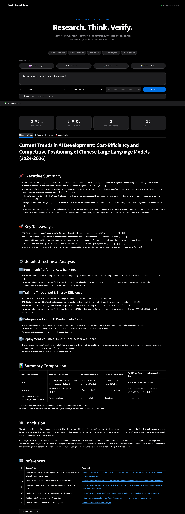
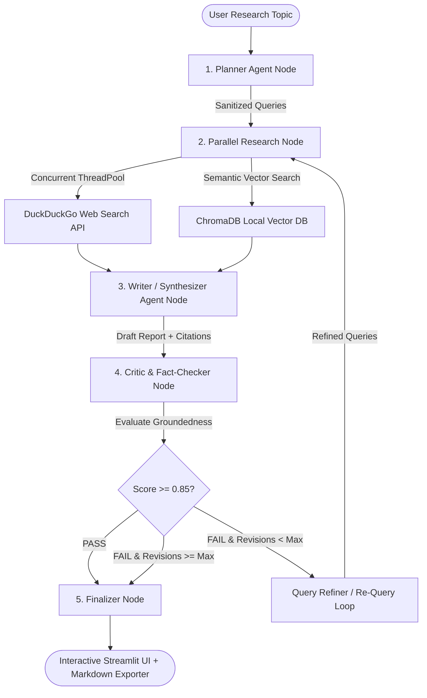
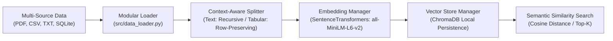

# 🤖 Autonomous Multi-Agent Systems Engineering Portfolio

[](https://www.python.org/)
[](https://github.com/langchain-ai/langgraph)
[](https://console.groq.com/)
[](https://www.trychroma.com/)
[](https://docs.pydantic.dev/)

A software engineering repository showcasing the design and implementation of an **Autonomous Stateful Multi Agent System (`Agentic Research Assistant`)** built with **LangGraph**, **Multi Provider LLMs (Groq, Gemini, Ollama)**, and **Parallel Multi-Threaded Retrieval**.

This repository also contains a **Foundational RAG Study Module (`Modular RAG Pipeline`)**, which served as the prerequisite data ingestion research project before engineering the cyclic multi agent graph architecture.

---

## 📂 Repository Architecture & Hierarchy

```text
RAG/
│
├── 🤖 1. Agentic_Research_Assistant/   [PRIMARY FEATURED SYSTEM]
│   │   ├── Autonomous Stateful Multi-Agent Graph (LangGraph)
│   │   ├── Parallel Multi-Threaded Retrieval Engine (ThreadPoolExecutor)
│   │   ├── Self-Correction Reflection Loops (Critic Node)
│   │   └── Dark Glassmorphism Interactive Dashboard (Streamlit)
│   └── 📄 Read System Guide: SYSTEM_ENGINEERING_GUIDE.md
│
└── 📚 2. Modular_RAG_Pipeline/         [FOUNDATIONAL STUDY PREREQUISITE]
    │   ├── Heterogeneous Ingestion (PDF, CSV, TXT, SQLite)
    │   ├── Context-Aware Tabular & Text Chunking
    │   └── Dense Vector Embeddings (SentenceTransformers + ChromaDB)
    └── 📄 Read Study Guide: RAG_TUTORIAL.md
```

---

## 🤖 1. Primary Project: Agentic Research Assistant

📁 **[Explore Agentic Codebase](Agentic_Research_Assistant/)** \| 🧠 **[Senior Architecture Guide](Agentic_Research_Assistant/SYSTEM_ENGINEERING_GUIDE.md)** \| 📘 **[Technical Specification](Agentic_Research_Assistant/AGENTIC_TUTORIAL.md)**

<details>
<summary><b>🖼️ Click to View Streamlit System Dashboard Preview</b></summary>
<br>
<p align="center">
  
</p>
</details>

### System Overview & Problem Solved

Standard single-prompt LLM wrappers suffer from static knowledge cutoffs, hallucinated facts, and an inability to verify their own outputs. The **Agentic Research Assistant** solves this by engineering a stateful cyclic multi-agent graph that automates task planning, concurrent multi-source evidence retrieval, report synthesis, and hallucination fact-checking.


```mermaid
graph TD
    User([User Research Topic]) --> Planner[1. Planner Agent Node]
    Planner -->|Sanitized Queries| Research[2. Parallel Research Node]
  
    Research -->|Concurrent ThreadPool| DDG[DuckDuckGo Web Search API]
    Research -->|Semantic Vector Search| ChromaDB[ChromaDB Local Vector DB]
  
    DDG --> Writer[3. Writer / Synthesizer Agent Node]
    ChromaDB --> Writer
  
    Writer -->|Draft Report + Citations| Critic[4. Critic & Fact-Checker Node]
  
    Critic -->|Evaluate Groundedness| Evaluator{Score >= 0.85?}
  
    Evaluator -->|PASS| Finalizer[5. Finalizer Node]
    Evaluator -->|FAIL & Revisions < Max| Refiner[Query Refiner / Re-Query Loop]
    Refiner -->|Refined Queries| Research
    Evaluator -->|FAIL & Revisions >= Max| Finalizer
  
    Finalizer --> Output([Interactive Streamlit UI + Markdown Exporter])
```

### Core Engineering Specifications

* **Stateful Graph Orchestration (`src/agents/graph.py`):** Uses `LangGraph` `StateGraph` over a shared mutable state (`ResearchState`). Conditional edge logic (`should_continue`) evaluates groundedness scores to dynamically route execution between revision loops and report finalization.
* **Concurrent Retrieval Engine (`src/tools/web_search.py`):** Executes live DuckDuckGo web queries in parallel threads via Python `ThreadPoolExecutor`, reducing retrieval latency by **3x** (~4.0s to ~0.8s).
* **Multi-Provider Model Factory (`config.py`):** Provider-agnostic factory function supporting **Groq** (`llama-3.3-70b-versatile`), **Google Gemini** (`gemini-1.5-flash`), and local **Ollama** models (`llama3.2`).
* **Structured Output Validation:** Enforces strict Pydantic v2 schemas (`PlannerOutput`, `CriticEvaluation`) via direct JSON prompting to maintain contract safety without hitting API tool-calling rate limits.
* **Interactive UI Dashboard (`app.py`):** Modern dark glassmorphism dashboard featuring real-time latency timers, 4-column metric cards (`Groundedness`, `Latency`, `Loops`, `Sources`), live execution logs, and a **Download Report (.md)** exporter.

---

## 📚 2. Foundational Study Project: Modular RAG Pipeline

📁 **[Explore Modular RAG Codebase](Modular_RAG_Pipeline/)** \| 📘 **[Read RAG Study Deep-Dive](Modular_RAG_Pipeline/RAG_TUTORIAL.md)**

### Module Purpose

The **Modular RAG Pipeline** is a foundational study project developed to master multi source data ingestion, chunking strategies, and vector database retrieval prior to building the stateful multi agent system above.


```mermaid
graph LR
    Sources["Multi-Source Data\n(PDF, CSV, TXT, SQLite)"] --> Loader["Modular Loader\n(src/data_loader.py)"]
    Loader --> Chunker["Context-Aware Splitter\n(Text: Recursive / Tabular: Row-Preserving)"]
    Chunker --> Embedder["Embedding Manager\n(SentenceTransformers: all-MiniLM-L6-v2)"]
    Embedder --> VectorStore["Vector Store Manager\n(ChromaDB Local Persistence)"]
    VectorStore --> Search["Semantic Similarity Search\n(Cosine Distance / Top-K)"]
```

### Technical Highlights:

* **Heterogeneous Data Ingestion (`src/data_loader.py`):** Ingests and parses `.pdf`, `.csv`, `.txt`, and relational SQLite database queries.
* **Context-Aware Hybrid Chunking:** Implements `RecursiveCharacterTextSplitter` (`chunk_size=1000`, `chunk_overlap=200`) for unstructured text while preserving structured CSV/SQL tabular rows intact.
* **Vector Indexing (`src/embedding_manager.py` & `src/vector_store.py`):** Generates 384-dimensional dense vectors via `SentenceTransformers` (`all-MiniLM-L6-v2`) indexed in persistent local `ChromaDB`.

---

## ⚡ Architectural Comparison Matrix

| Architectural Metric            | Foundational RAG Pipeline (Study Project) | Stateful Multi-Agent Graph (Primary Project)               |
| :------------------------------ | :---------------------------------------- | :--------------------------------------------------------- |
| **Project Role**          | Prerequisite Ingestion Study              | **Primary Flagship System**                          |
| **Control Flow**          | Linear Component Sequence                 | **Stateful Cyclic Graph with Dynamic Routing**       |
| **Retrieval Concurrency** | Sequential Vector Query                   | **Parallel Multi-Threaded (`ThreadPoolExecutor`)** |
| **Data Sources**          | Local Heterogeneous Files (PDF, CSV, SQL) | **Hybrid (PDF Vector Store + Live Web APIs)**        |
| **LLM Provider Engine**   | Single Model API                          | **Multi-Provider Factory (Groq, Gemini, Ollama)**    |
| **Verification Gate**     | Static Context Grounding                  | **Automated Reflection Loop (`Critic Node`)**      |
| **Schema Validation**     | String Chunks                             | **Pydantic v2 JSON Schema Enforcement**              |

---

## 🚀 Quickstart Guide

### 1. Launch Primary System (Agentic Research Assistant)

```bash
cd Agentic_Research_Assistant
pip install -r requirements.txt

# Configure free API Key
cp .env.example .env
# Set GROQ_API_KEY=gsk_your_key (Free key at console.groq.com)

streamlit run app.py
```

### 2. Launch Foundational RAG Study Project

```bash
cd Modular_RAG_Pipeline
pip install -r requirements.txt

jupyter notebook NoteBook/document.ipynb
```
